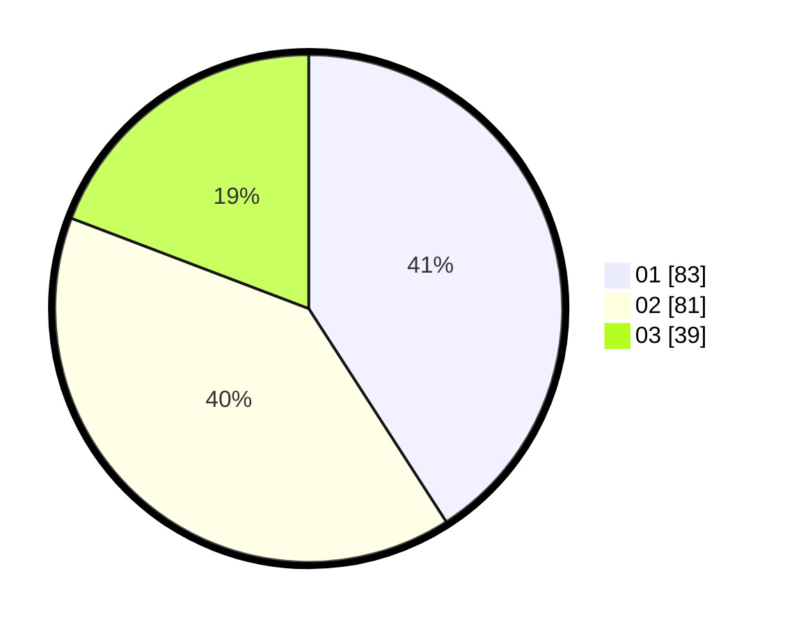

# Hasil

Hasil perolehan suara paslon dapat dilihat pada file paslon-01.txt, paslon-02.txt, dan paslon-03.txt.

Jika tidak ada, artinya data tersebut belum ada pada SIREKAP.

## Perolehan Suara

 * Paslon 01: **83**.
 * Paslon 02: **81**.
 * Paslon 03: **39**.

## Foto C Plano

https://sirekap-obj-formc.kpu.go.id/a232/pemilu/ppwp/31/75/03/10/02/3175031002051-20240215-233423--d12a3859-5a95-435c-94fb-ed6b686dbf13.jpg

https://sirekap-obj-formc.kpu.go.id/a232/pemilu/ppwp/31/75/03/10/02/3175031002051-20240215-233427--aa71470f-93e4-4b27-b4af-9483cd726de9.jpg

https://sirekap-obj-formc.kpu.go.id/a232/pemilu/ppwp/31/75/03/10/02/3175031002051-20240215-233425--46085bec-e99a-4fee-8d07-0cbfc6c1fe4f.jpg

## DATA PEMILIH TETAP

Jumlah pemilih dalam DPT: **261**.
 * L: **132**.
 * P: **129**.

## DATA PENGGUNA HAK PILIH

Jumlah pengguna hak pilih dalam DPT: **205**.
 * L: **99**.
 * P: **106**.

Jumlah pengguna hak pilih dalam DPTb: **0**.
 * L: **0**.
 * P: **0**.

Jumlah pengguna hak pilih dalam DPK: **0**.
 * L: **0**.
 * P: **0**.

Jumlah pengguna hak pilih: **205**.
 * L: **99**.
 * P: **106**.

## JUMLAH SUARA SAH DAN TIDAK SAH

JUMLAH SELURUH SUARA SAH: **203**.

JUMLAH SUARA TIDAK SAH: **2**.

JUMLAH SELURUH SUARA SAH DAN SUARA TIDAK SAH: **205**.
