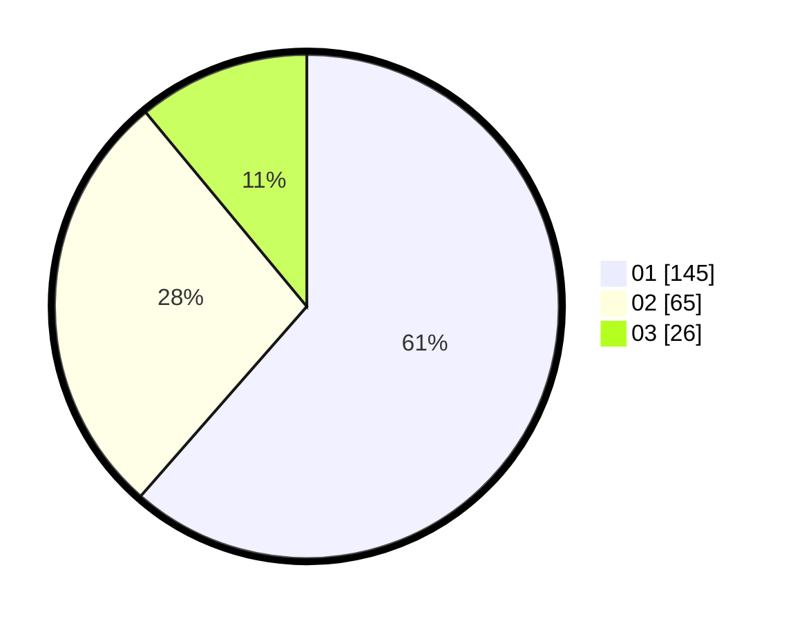

# Hasil

Hasil perolehan suara paslon dapat dilihat pada file paslon-01.txt, paslon-02.txt, dan paslon-03.txt.

Jika tidak ada, artinya data tersebut belum ada pada SIREKAP.

## Perolehan Suara

 * Paslon 01: **145**.
 * Paslon 02: **65**.
 * Paslon 03: **26**.

## Foto C Plano

https://sirekap-obj-formc.kpu.go.id/ac88/pemilu/ppwp/31/75/03/10/02/3175031002053-20240215-004616--f802a59c-ae70-46da-b03f-bce94937efae.jpg

https://sirekap-obj-formc.kpu.go.id/ac88/pemilu/ppwp/31/75/03/10/02/3175031002053-20240215-004622--5345abf9-4aac-4dc8-a8e9-a9e301212e8c.jpg

https://sirekap-obj-formc.kpu.go.id/ac88/pemilu/ppwp/31/75/03/10/02/3175031002053-20240215-000356--8f69e7fd-6c58-447f-b80f-69cdca0bcfb7.jpg
