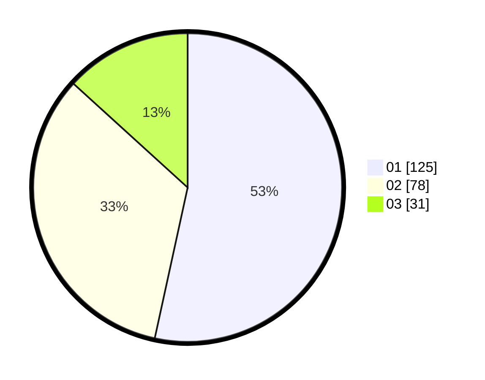

# Hasil

Hasil perolehan suara paslon dapat dilihat pada file paslon-01.txt, paslon-02.txt, dan paslon-03.txt.

Jika tidak ada, artinya data tersebut belum ada pada SIREKAP.

## Perolehan Suara

 * Paslon 01: **125**.
 * Paslon 02: **78**.
 * Paslon 03: **31**.

## Foto C Plano

https://sirekap-obj-formc.kpu.go.id/79bb/pemilu/ppwp/31/75/03/10/02/3175031002058-20240214-230551--76ebb6b5-aabd-4d6f-a532-5e0d9a87250e.jpg

https://sirekap-obj-formc.kpu.go.id/79bb/pemilu/ppwp/31/75/03/10/02/3175031002058-20240214-230610--6f66f6d7-16a9-413d-8595-9a2bcbbbc833.jpg

https://sirekap-obj-formc.kpu.go.id/79bb/pemilu/ppwp/31/75/03/10/02/3175031002058-20240214-230625--c5682f17-3bd6-423e-96dd-21c5d8088529.jpg

## DATA PEMILIH TETAP

Jumlah pemilih dalam DPT: **273**.
 * L: **143**.
 * P: **130**.

## DATA PENGGUNA HAK PILIH

Jumlah pengguna hak pilih dalam DPT: **234**.
 * L: **118**.
 * P: **116**.

Jumlah pengguna hak pilih dalam DPTb: **0**.
 * L: **0**.
 * P: **0**.

Jumlah pengguna hak pilih dalam DPK: **0**.
 * L: **0**.
 * P: **0**.

Jumlah pengguna hak pilih: **234**.
 * L: **118**.
 * P: **116**.

## JUMLAH SUARA SAH DAN TIDAK SAH

JUMLAH SELURUH SUARA SAH: **234**.

JUMLAH SUARA TIDAK SAH: **0**.

JUMLAH SELURUH SUARA SAH DAN SUARA TIDAK SAH: **234**.
