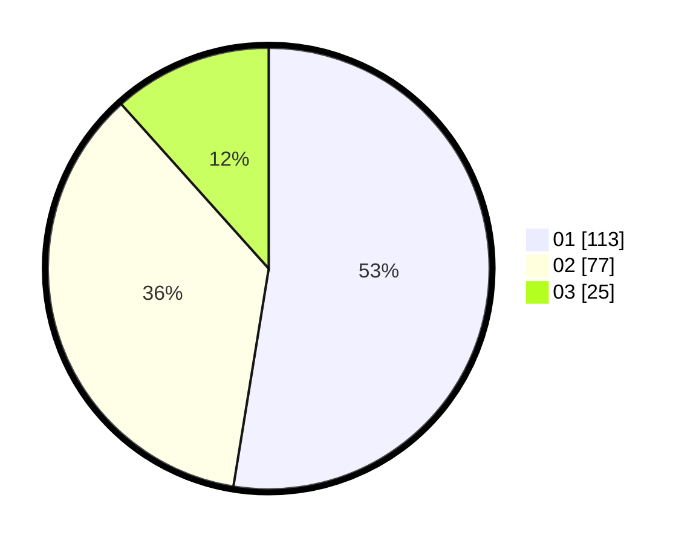

# Hasil

Hasil perolehan suara paslon dapat dilihat pada file paslon-01.txt, paslon-02.txt, dan paslon-03.txt.

Jika tidak ada, artinya data tersebut belum ada pada SIREKAP.

## Perolehan Suara

 * Paslon 01: **113**.
 * Paslon 02: **77**.
 * Paslon 03: **25**.

## Foto C Plano

https://sirekap-obj-formc.kpu.go.id/b481/pemilu/ppwp/31/75/03/10/02/3175031002059-20240214-230050--d021fb5e-e3c3-43e6-ac45-b29c168abe80.jpg

https://sirekap-obj-formc.kpu.go.id/b481/pemilu/ppwp/31/75/03/10/02/3175031002059-20240214-225558--79237e16-7fbe-41e2-b69c-2397b58591a2.jpg

https://sirekap-obj-formc.kpu.go.id/b481/pemilu/ppwp/31/75/03/10/02/3175031002059-20240214-230359--3b776960-1ee7-4d81-9083-2f4c5929898f.jpg
