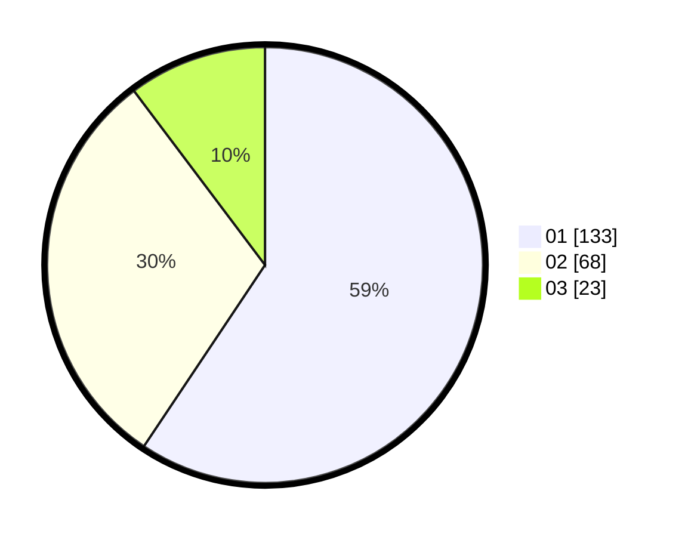

# Hasil

Hasil perolehan suara paslon dapat dilihat pada file paslon-01.txt, paslon-02.txt, dan paslon-03.txt.

Jika tidak ada, artinya data tersebut belum ada pada SIREKAP.

## Perolehan Suara

 * Paslon 01: **133**.
 * Paslon 02: **68**.
 * Paslon 03: **23**.

## Foto C Plano

https://sirekap-obj-formc.kpu.go.id/d2fb/pemilu/ppwp/31/75/03/10/02/3175031002062-20240216-120549--b7d3e69f-b22c-48bb-a64d-5e4ce0a494bd.jpg

https://sirekap-obj-formc.kpu.go.id/d2fb/pemilu/ppwp/31/75/03/10/02/3175031002062-20240216-120552--5e7b7e59-0501-4708-afe6-7aa2c58cc613.jpg

https://sirekap-obj-formc.kpu.go.id/d2fb/pemilu/ppwp/31/75/03/10/02/3175031002062-20240216-120550--e62c6a00-28e7-46c5-b28d-92810fe1c10a.jpg

## DATA PEMILIH TETAP

Jumlah pemilih dalam DPT: **271**.
 * L: **136**.
 * P: **135**.

## DATA PENGGUNA HAK PILIH

Jumlah pengguna hak pilih dalam DPT: **222**.
 * L: **107**.
 * P: **115**.

Jumlah pengguna hak pilih dalam DPTb: **1**.
 * L: **1**.
 * P: **0**.

Jumlah pengguna hak pilih dalam DPK: **3**.
 * L: **2**.
 * P: **1**.

Jumlah pengguna hak pilih: **226**.
 * L: **110**.
 * P: **116**.

## JUMLAH SUARA SAH DAN TIDAK SAH

JUMLAH SELURUH SUARA SAH: **224**.

JUMLAH SUARA TIDAK SAH: **2**.

JUMLAH SELURUH SUARA SAH DAN SUARA TIDAK SAH: **226**.
