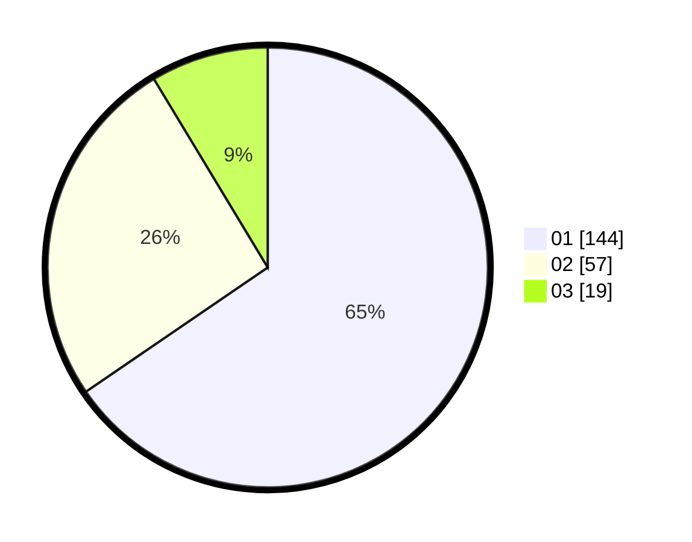

# Hasil

Hasil perolehan suara paslon dapat dilihat pada file paslon-01.txt, paslon-02.txt, dan paslon-03.txt.

Jika tidak ada, artinya data tersebut belum ada pada SIREKAP.

## Perolehan Suara

 * Paslon 01: **144**.
 * Paslon 02: **57**.
 * Paslon 03: **19**.

## Foto C Plano

https://sirekap-obj-formc.kpu.go.id/f95a/pemilu/ppwp/31/75/03/10/02/3175031002063-20240216-180032--07ac7d8a-d004-4af4-b4a3-36def60d666d.jpg

https://sirekap-obj-formc.kpu.go.id/f95a/pemilu/ppwp/31/75/03/10/02/3175031002063-20240216-180034--f3984557-fe5b-4b0b-a53d-6b9cdabac0ba.jpg

https://sirekap-obj-formc.kpu.go.id/f95a/pemilu/ppwp/31/75/03/10/02/3175031002063-20240216-180033--ef248e15-e538-4819-82af-2443eb24bad7.jpg

## DATA PEMILIH TETAP

Jumlah pemilih dalam DPT: **277**.
 * L: **134**.
 * P: **143**.

## DATA PENGGUNA HAK PILIH

Jumlah pengguna hak pilih dalam DPT: **216**.
 * L: **102**.
 * P: **114**.

Jumlah pengguna hak pilih dalam DPTb: **6**.
 * L: **3**.
 * P: **3**.

Jumlah pengguna hak pilih dalam DPK: **1**.
 * L: **0**.
 * P: **1**.

Jumlah pengguna hak pilih: **223**.
 * L: **105**.
 * P: **118**.

## JUMLAH SUARA SAH DAN TIDAK SAH

JUMLAH SELURUH SUARA SAH: **220**.

JUMLAH SUARA TIDAK SAH: **3**.

JUMLAH SELURUH SUARA SAH DAN SUARA TIDAK SAH: **223**.
