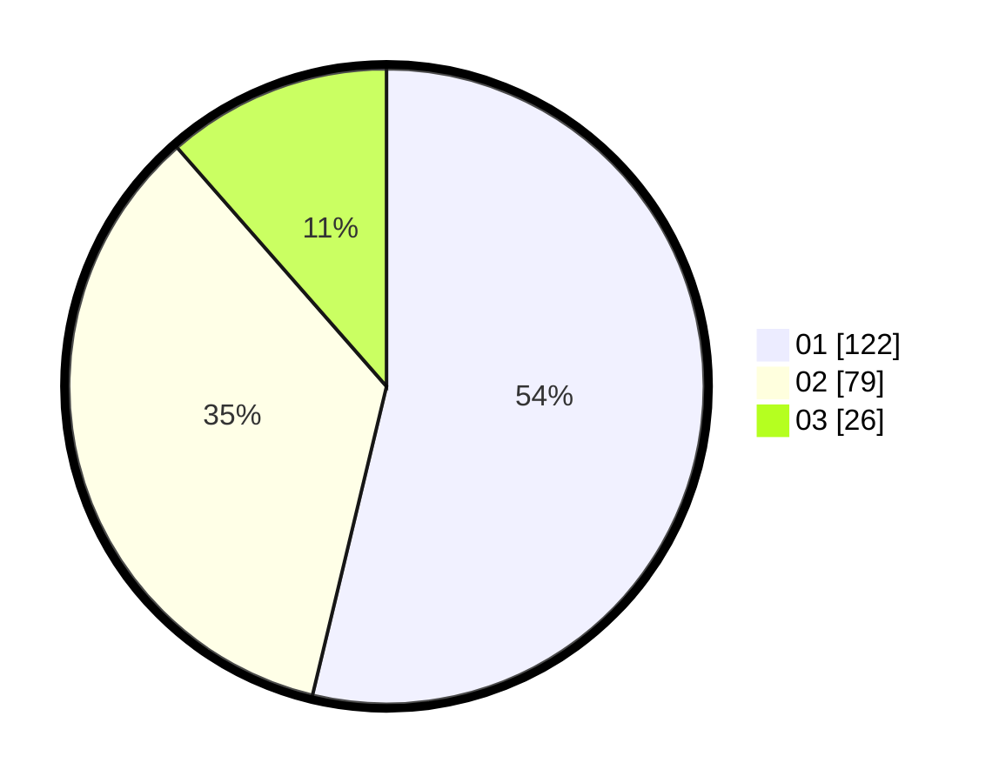

# Hasil

Hasil perolehan suara paslon dapat dilihat pada file paslon-01.txt, paslon-02.txt, dan paslon-03.txt.

Jika tidak ada, artinya data tersebut belum ada pada SIREKAP.

## Perolehan Suara

 * Paslon 01: **122**.
 * Paslon 02: **79**.
 * Paslon 03: **26**.

## Foto C Plano

https://sirekap-obj-formc.kpu.go.id/74d0/pemilu/ppwp/31/75/03/10/02/3175031002064-20240215-223321--63486da6-0857-4acb-b1ce-d9a2e65dfed2.jpg

https://sirekap-obj-formc.kpu.go.id/74d0/pemilu/ppwp/31/75/03/10/02/3175031002064-20240215-223326--fd5c60cf-c31a-4731-bdd1-97f84ae54447.jpg

https://sirekap-obj-formc.kpu.go.id/74d0/pemilu/ppwp/31/75/03/10/02/3175031002064-20240215-223325--e2887da2-ebaa-4310-9a69-64222cc331c7.jpg

## DATA PEMILIH TETAP

Jumlah pemilih dalam DPT: **275**.
 * L: **133**.
 * P: **142**.

## DATA PENGGUNA HAK PILIH

Jumlah pengguna hak pilih dalam DPT: **228**.
 * L: **104**.
 * P: **124**.

Jumlah pengguna hak pilih dalam DPTb: **0**.
 * L: **0**.
 * P: **0**.

Jumlah pengguna hak pilih dalam DPK: **4**.
 * L: **2**.
 * P: **2**.

Jumlah pengguna hak pilih: **232**.
 * L: **106**.
 * P: **126**.

## JUMLAH SUARA SAH DAN TIDAK SAH

JUMLAH SELURUH SUARA SAH: **227**.

JUMLAH SUARA TIDAK SAH: **5**.

JUMLAH SELURUH SUARA SAH DAN SUARA TIDAK SAH: **232**.
