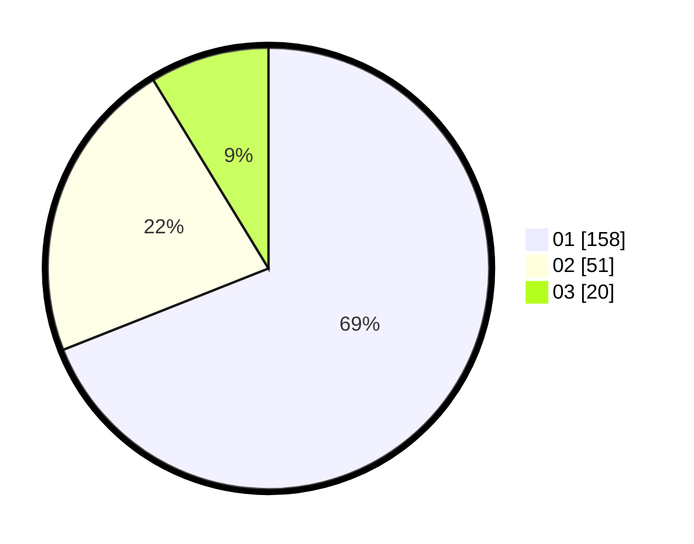

# Hasil

Hasil perolehan suara paslon dapat dilihat pada file paslon-01.txt, paslon-02.txt, dan paslon-03.txt.

Jika tidak ada, artinya data tersebut belum ada pada SIREKAP.

## Perolehan Suara

 * Paslon 01: **158**.
 * Paslon 02: **51**.
 * Paslon 03: **20**.

## Foto C Plano

https://sirekap-obj-formc.kpu.go.id/7e01/pemilu/ppwp/31/75/03/10/02/3175031002065-20240214-155014--169cbe99-5b08-4927-8886-899555298352.jpg

https://sirekap-obj-formc.kpu.go.id/7e01/pemilu/ppwp/31/75/03/10/02/3175031002065-20240214-155657--f46c176c-1fea-4341-840d-7e1fc785fb87.jpg

https://sirekap-obj-formc.kpu.go.id/7e01/pemilu/ppwp/31/75/03/10/02/3175031002065-20240214-155745--812e959d-5f7b-4391-a296-08391685fbcc.jpg

## DATA PEMILIH TETAP

Jumlah pemilih dalam DPT: **274**.
 * L: **130**.
 * P: **144**.

## DATA PENGGUNA HAK PILIH

Jumlah pengguna hak pilih dalam DPT: **227**.
 * L: **105**.
 * P: **122**.

Jumlah pengguna hak pilih dalam DPTb: **2**.
 * L: **1**.
 * P: **1**.

Jumlah pengguna hak pilih dalam DPK: **2**.
 * L: **1**.
 * P: **1**.

Jumlah pengguna hak pilih: **231**.
 * L: **107**.
 * P: **124**.

## JUMLAH SUARA SAH DAN TIDAK SAH

JUMLAH SELURUH SUARA SAH: **229**.

JUMLAH SUARA TIDAK SAH: **2**.

JUMLAH SELURUH SUARA SAH DAN SUARA TIDAK SAH: **231**.
