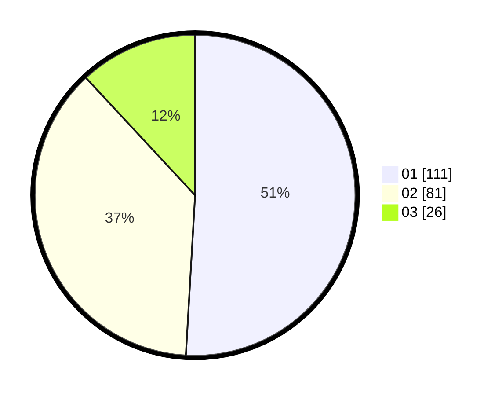

# Hasil

Hasil perolehan suara paslon dapat dilihat pada file paslon-01.txt, paslon-02.txt, dan paslon-03.txt.

Jika tidak ada, artinya data tersebut belum ada pada SIREKAP.

## Perolehan Suara

 * Paslon 01: **111**.
 * Paslon 02: **81**.
 * Paslon 03: **26**.

## Foto C Plano

https://sirekap-obj-formc.kpu.go.id/e44a/pemilu/ppwp/31/75/03/10/02/3175031002075-20240214-223645--a9bfc693-a2e2-48a1-a83e-44120a0e8f31.jpg

https://sirekap-obj-formc.kpu.go.id/e44a/pemilu/ppwp/31/75/03/10/02/3175031002075-20240214-223731--2bd48015-7bab-4bde-bf55-2e6c7ddcfc19.jpg

https://sirekap-obj-formc.kpu.go.id/e44a/pemilu/ppwp/31/75/03/10/02/3175031002075-20240214-223820--aed2ee45-4322-493a-a5f6-a1278da356ac.jpg

## DATA PEMILIH TETAP

Jumlah pemilih dalam DPT: **258**.
 * L: **130**.
 * P: **128**.

## DATA PENGGUNA HAK PILIH

Jumlah pengguna hak pilih dalam DPT: **218**.
 * L: **102**.
 * P: **116**.

Jumlah pengguna hak pilih dalam DPTb: **0**.
 * L: **0**.
 * P: **0**.

Jumlah pengguna hak pilih dalam DPK: **2**.
 * L: **0**.
 * P: **2**.

Jumlah pengguna hak pilih: **220**.
 * L: **102**.
 * P: **118**.

## JUMLAH SUARA SAH DAN TIDAK SAH

JUMLAH SELURUH SUARA SAH: **218**.

JUMLAH SUARA TIDAK SAH: **2**.

JUMLAH SELURUH SUARA SAH DAN SUARA TIDAK SAH: **220**.
