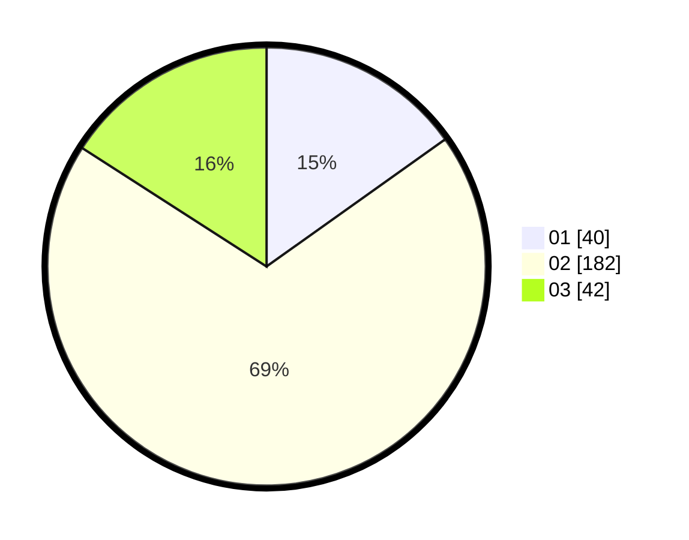

# Hasil

Hasil perolehan suara paslon dapat dilihat pada file paslon-01.txt, paslon-02.txt, dan paslon-03.txt.

Jika tidak ada, artinya data tersebut belum ada pada SIREKAP.

## Perolehan Suara

 * Paslon 01: **40**.
 * Paslon 02: **182**.
 * Paslon 03: **42**.

## Foto C Plano

https://sirekap-obj-formc.kpu.go.id/819f/pemilu/ppwp/31/75/03/10/02/3175031002079-20240215-005901--9384802d-ada9-4959-90b4-428ef3c4064d.jpg

https://sirekap-obj-formc.kpu.go.id/819f/pemilu/ppwp/31/75/03/10/02/3175031002079-20240215-010915--da40bf07-d668-4132-af07-2b4fbffa4a1f.jpg

https://sirekap-obj-formc.kpu.go.id/819f/pemilu/ppwp/31/75/03/10/02/3175031002079-20240214-215803--5e44f5db-0dda-45c2-bee0-3f28737c5706.jpg
