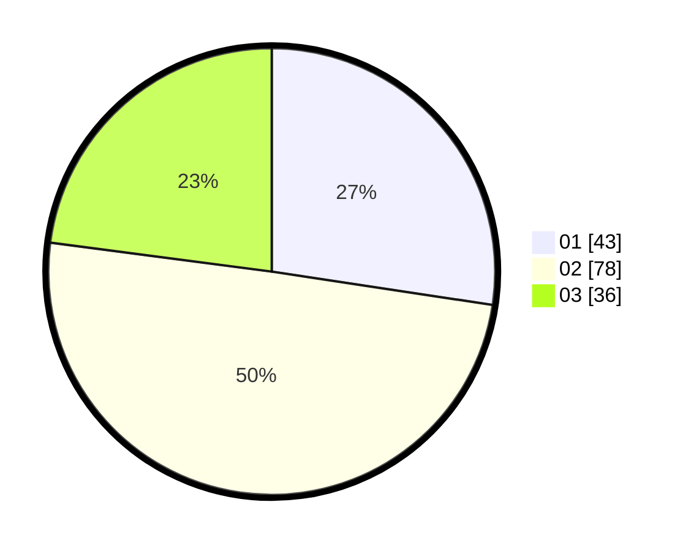

# Hasil

Hasil perolehan suara paslon dapat dilihat pada file paslon-01.txt, paslon-02.txt, dan paslon-03.txt.

Jika tidak ada, artinya data tersebut belum ada pada SIREKAP.

## Perolehan Suara

 * Paslon 01: **43**.
 * Paslon 02: **78**.
 * Paslon 03: **36**.

## Foto C Plano

https://sirekap-obj-formc.kpu.go.id/fb59/pemilu/ppwp/31/75/03/10/02/3175031002080-20240214-232255--a582f0a3-0a19-458a-b09e-3ace17646627.jpg

https://sirekap-obj-formc.kpu.go.id/fb59/pemilu/ppwp/31/75/03/10/02/3175031002080-20240214-232337--3d9a103c-a998-4bba-a589-106b29b42e94.jpg

https://sirekap-obj-formc.kpu.go.id/fb59/pemilu/ppwp/31/75/03/10/02/3175031002080-20240214-232404--071f677d-84a0-431d-b822-26a4fe70f05a.jpg
