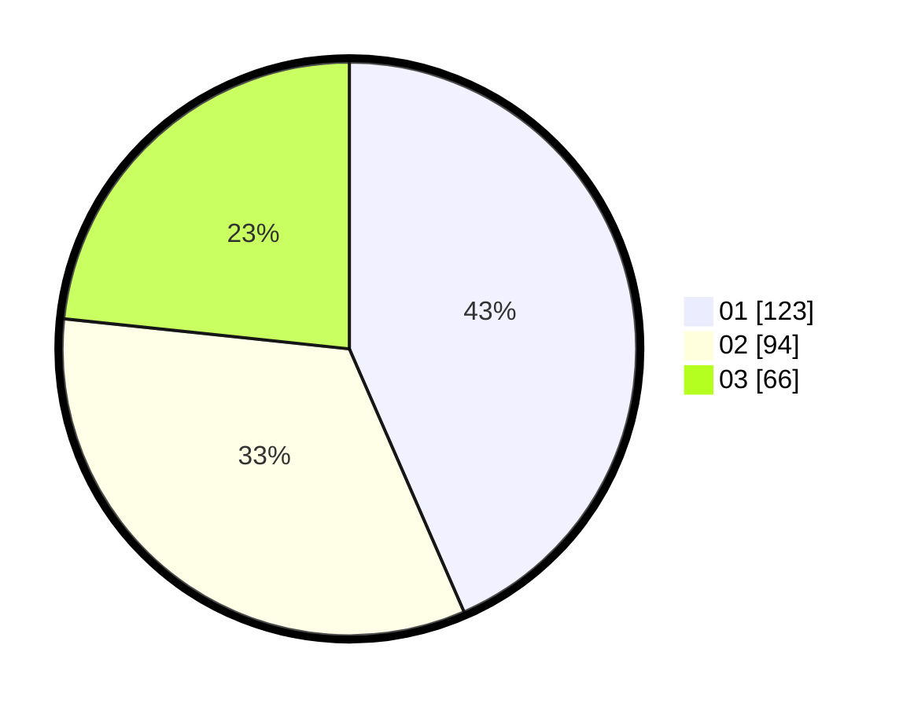

# Hasil

Hasil perolehan suara paslon dapat dilihat pada file paslon-01.txt, paslon-02.txt, dan paslon-03.txt.

Jika tidak ada, artinya data tersebut belum ada pada SIREKAP.

## Perolehan Suara

 * Paslon 01: **123**.
 * Paslon 02: **94**.
 * Paslon 03: **66**.

## Foto C Plano

https://sirekap-obj-formc.kpu.go.id/bf8e/pemilu/ppwp/31/75/03/10/02/3175031002085-20240214-193902--04fc87a6-e528-4d47-9768-e79625a71257.jpg

https://sirekap-obj-formc.kpu.go.id/bf8e/pemilu/ppwp/31/75/03/10/02/3175031002085-20240216-071030--c14ab674-88e6-4898-8f72-4d75ef966287.jpg

https://sirekap-obj-formc.kpu.go.id/bf8e/pemilu/ppwp/31/75/03/10/02/3175031002085-20240214-211651--f1dcd4f4-50b4-4d7f-9909-fbacfef2f39a.jpg

## DATA PEMILIH TETAP

Jumlah pemilih dalam DPT: **293**.
 * L: **139**.
 * P: **154**.

## DATA PENGGUNA HAK PILIH

Jumlah pengguna hak pilih dalam DPT: **250**.
 * L: **115**.
 * P: **135**.

Jumlah pengguna hak pilih dalam DPTb: **30**.
 * L: **16**.
 * P: **14**.

Jumlah pengguna hak pilih dalam DPK: **6**.
 * L: **3**.
 * P: **3**.

Jumlah pengguna hak pilih: **286**.
 * L: **134**.
 * P: **152**.

## JUMLAH SUARA SAH DAN TIDAK SAH

JUMLAH SELURUH SUARA SAH: **283**.

JUMLAH SUARA TIDAK SAH: **3**.

JUMLAH SELURUH SUARA SAH DAN SUARA TIDAK SAH: **286**.
