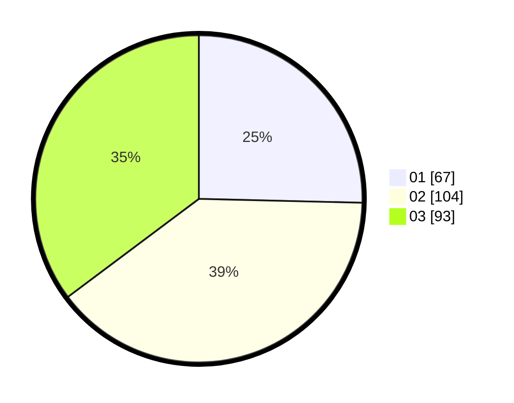

# Hasil

Hasil perolehan suara paslon dapat dilihat pada file paslon-01.txt, paslon-02.txt, dan paslon-03.txt.

Jika tidak ada, artinya data tersebut belum ada pada SIREKAP.

## Perolehan Suara

 * Paslon 01: **67**.
 * Paslon 02: **104**.
 * Paslon 03: **93**.

## Foto C Plano

https://sirekap-obj-formc.kpu.go.id/ec83/pemilu/ppwp/31/75/03/10/02/3175031002086-20240214-232303--c5f782bc-709b-41af-9b59-be7beb1d3b0d.jpg

https://sirekap-obj-formc.kpu.go.id/ec83/pemilu/ppwp/31/75/03/10/02/3175031002086-20240214-232856--fc432cdc-20f9-4f82-9ae8-2b3f781d75cf.jpg

https://sirekap-obj-formc.kpu.go.id/ec83/pemilu/ppwp/31/75/03/10/02/3175031002086-20240214-233101--0e765746-6dc6-49c6-b3cc-c704688af2b6.jpg
