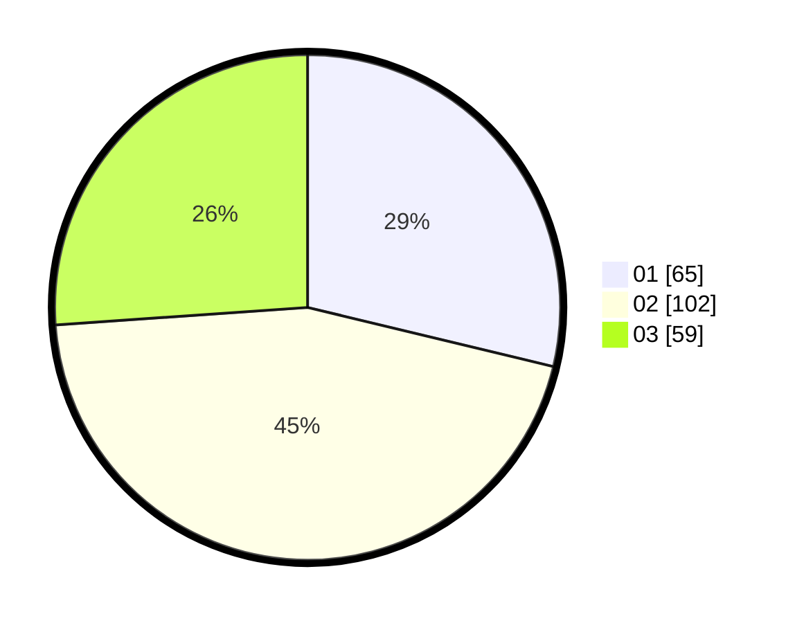

# Hasil

Hasil perolehan suara paslon dapat dilihat pada file paslon-01.txt, paslon-02.txt, dan paslon-03.txt.

Jika tidak ada, artinya data tersebut belum ada pada SIREKAP.

## Perolehan Suara

 * Paslon 01: **65**.
 * Paslon 02: **102**.
 * Paslon 03: **59**.

## Foto C Plano

https://sirekap-obj-formc.kpu.go.id/688e/pemilu/ppwp/31/75/03/10/02/3175031002087-20240214-234946--03e2a011-c1dd-4613-8925-cba6d93ebd93.jpg

https://sirekap-obj-formc.kpu.go.id/688e/pemilu/ppwp/31/75/03/10/02/3175031002087-20240214-235047--477b96fa-f7d2-4ec4-81ad-dfce9b4a0438.jpg

https://sirekap-obj-formc.kpu.go.id/688e/pemilu/ppwp/31/75/03/10/02/3175031002087-20240214-235129--78423c82-642c-4336-b73a-4fb96dfeb485.jpg
