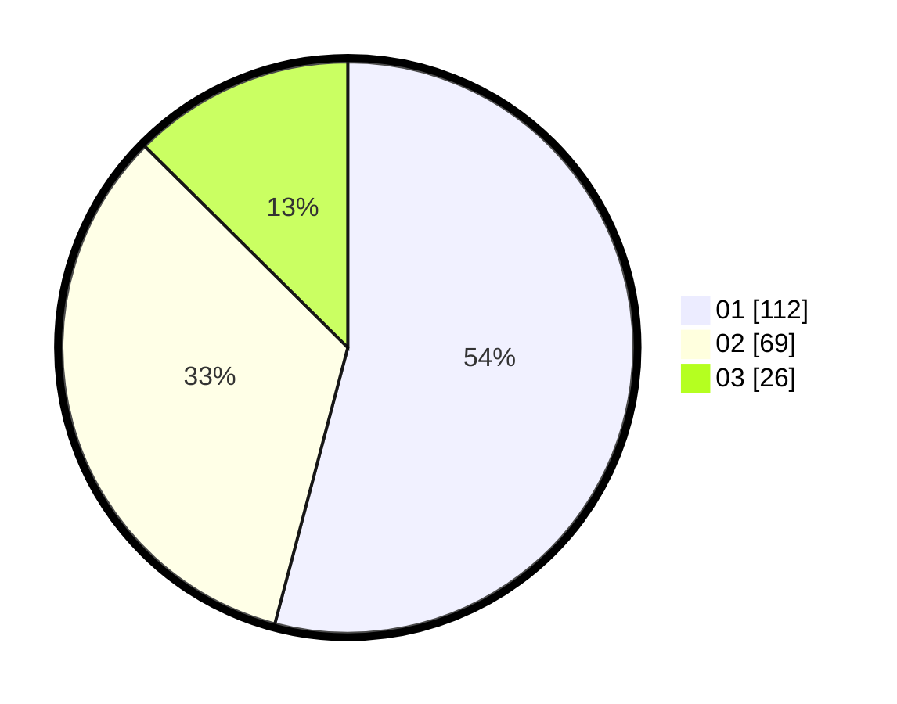

# Hasil

Hasil perolehan suara paslon dapat dilihat pada file paslon-01.txt, paslon-02.txt, dan paslon-03.txt.

Jika tidak ada, artinya data tersebut belum ada pada SIREKAP.

## Perolehan Suara

 * Paslon 01: **112**.
 * Paslon 02: **69**.
 * Paslon 03: **26**.

## Foto C Plano

https://sirekap-obj-formc.kpu.go.id/fb02/pemilu/ppwp/31/75/03/10/02/3175031002089-20240215-011134--16634107-7276-4239-bc5b-4ac24bfd32c2.jpg

https://sirekap-obj-formc.kpu.go.id/fb02/pemilu/ppwp/31/75/03/10/02/3175031002089-20240215-013419--9eabe5ac-0c36-48ce-8619-b8d38f700901.jpg

https://sirekap-obj-formc.kpu.go.id/fb02/pemilu/ppwp/31/75/03/10/02/3175031002089-20240215-013636--1f851440-795e-4890-917d-fb4fe004db09.jpg
