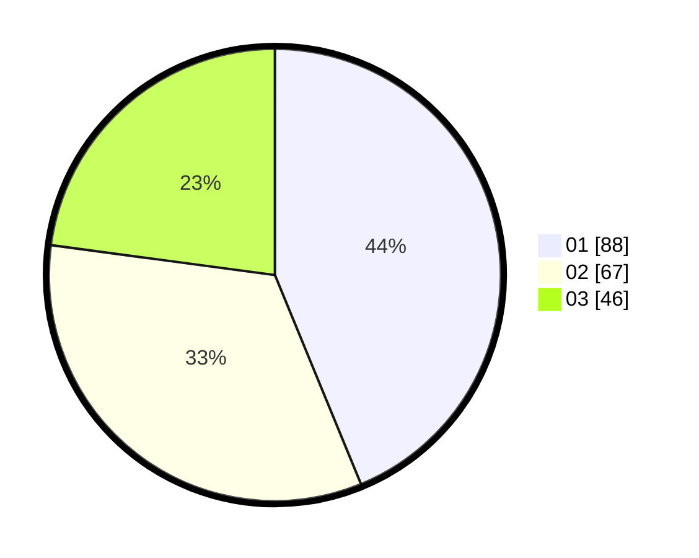

# Hasil

Hasil perolehan suara paslon dapat dilihat pada file paslon-01.txt, paslon-02.txt, dan paslon-03.txt.

Jika tidak ada, artinya data tersebut belum ada pada SIREKAP.

## Perolehan Suara

 * Paslon 01: **88**.
 * Paslon 02: **67**.
 * Paslon 03: **46**.

## Foto C Plano

https://sirekap-obj-formc.kpu.go.id/d002/pemilu/ppwp/31/75/03/10/02/3175031002093-20240214-193017--bd9bd6fc-f836-4aea-befd-857e0a0ca705.jpg

https://sirekap-obj-formc.kpu.go.id/d002/pemilu/ppwp/31/75/03/10/02/3175031002093-20240215-223638--5979b68e-33e4-44bc-acf4-8535952c63f6.jpg

https://sirekap-obj-formc.kpu.go.id/d002/pemilu/ppwp/31/75/03/10/02/3175031002093-20240214-193218--85cfc5de-9f69-48d4-bf76-6318a4c6b13d.jpg

## DATA PEMILIH TETAP

Jumlah pemilih dalam DPT: **238**.
 * L: **118**.
 * P: **120**.

## DATA PENGGUNA HAK PILIH

Jumlah pengguna hak pilih dalam DPT: **188**.
 * L: **88**.
 * P: **100**.

Jumlah pengguna hak pilih dalam DPTb: **14**.
 * L: **6**.
 * P: **8**.

Jumlah pengguna hak pilih dalam DPK: **2**.
 * L: **1**.
 * P: **1**.

Jumlah pengguna hak pilih: **204**.
 * L: **95**.
 * P: **109**.

## JUMLAH SUARA SAH DAN TIDAK SAH

JUMLAH SELURUH SUARA SAH: **201**.

JUMLAH SUARA TIDAK SAH: **3**.

JUMLAH SELURUH SUARA SAH DAN SUARA TIDAK SAH: **204**.
