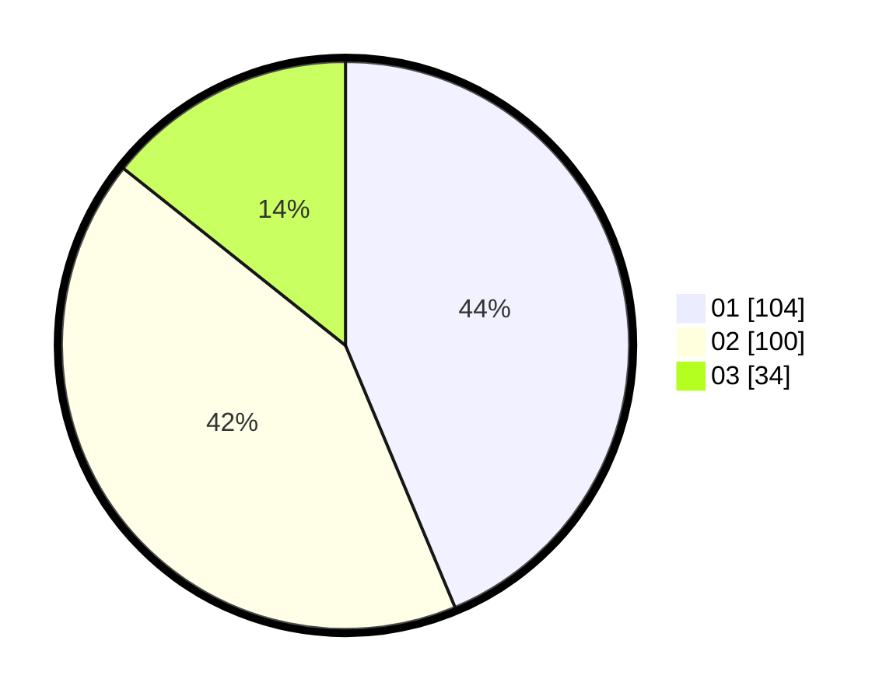

# Hasil

Hasil perolehan suara paslon dapat dilihat pada file paslon-01.txt, paslon-02.txt, dan paslon-03.txt.

Jika tidak ada, artinya data tersebut belum ada pada SIREKAP.

## Perolehan Suara

 * Paslon 01: **104**.
 * Paslon 02: **100**.
 * Paslon 03: **34**.

## Foto C Plano

https://sirekap-obj-formc.kpu.go.id/b0dd/pemilu/ppwp/31/75/03/10/02/3175031002098-20240214-233752--e546aaac-9f40-4821-9e25-1060ff7f38e6.jpg

https://sirekap-obj-formc.kpu.go.id/b0dd/pemilu/ppwp/31/75/03/10/02/3175031002098-20240214-234013--531fa113-46fe-4a09-993d-bb23330ed8f6.jpg

https://sirekap-obj-formc.kpu.go.id/b0dd/pemilu/ppwp/31/75/03/10/02/3175031002098-20240214-234117--9a54597e-63c8-46e7-a9e9-e7a24326958d.jpg
