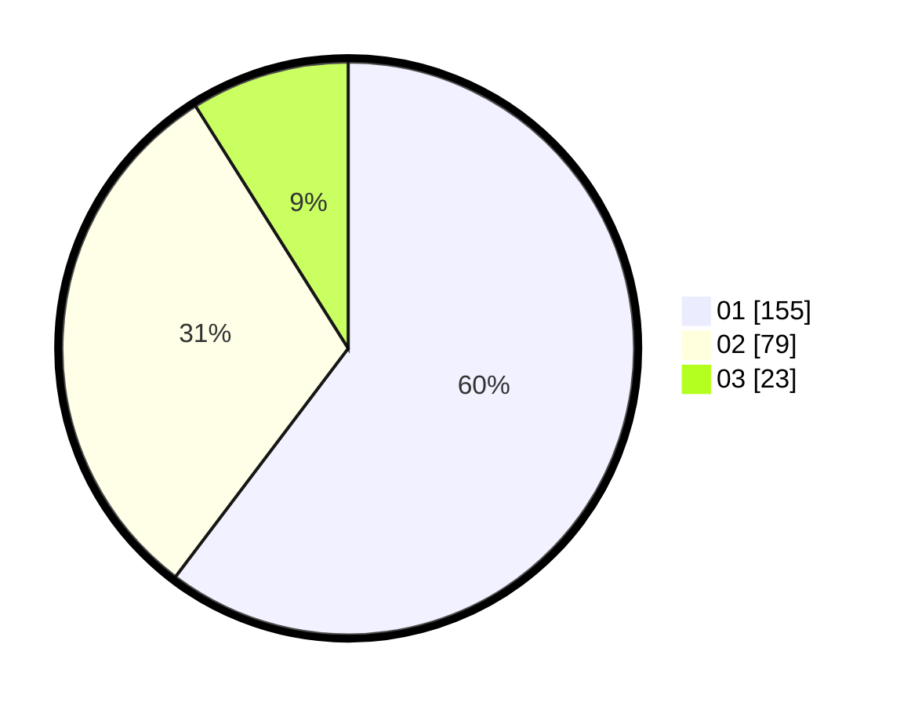

# Hasil

Hasil perolehan suara paslon dapat dilihat pada file paslon-01.txt, paslon-02.txt, dan paslon-03.txt.

Jika tidak ada, artinya data tersebut belum ada pada SIREKAP.

## Perolehan Suara

 * Paslon 01: **155**.
 * Paslon 02: **79**.
 * Paslon 03: **23**.

## Foto C Plano

https://sirekap-obj-formc.kpu.go.id/51c9/pemilu/ppwp/31/75/03/10/02/3175031002100-20240215-175004--9f75aa19-8ba7-4fa9-aaa1-18da1c039d5d.jpg

https://sirekap-obj-formc.kpu.go.id/51c9/pemilu/ppwp/31/75/03/10/02/3175031002100-20240215-175038--dcf8bbd7-9e3c-4f20-9e1d-30a716e36a26.jpg

https://sirekap-obj-formc.kpu.go.id/51c9/pemilu/ppwp/31/75/03/10/02/3175031002100-20240215-003931--fbd7149d-ec06-43ae-935a-db35c4fc098c.jpg
