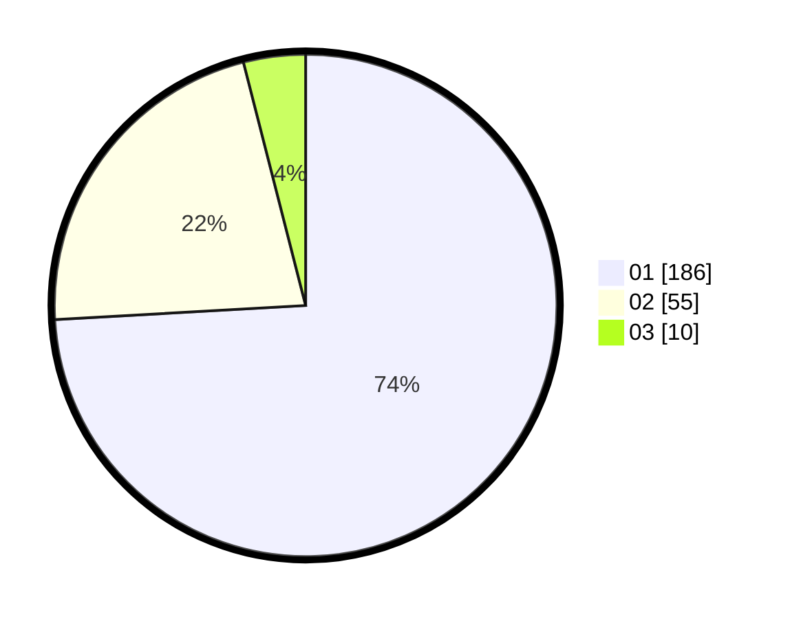

# Hasil

Hasil perolehan suara paslon dapat dilihat pada file paslon-01.txt, paslon-02.txt, dan paslon-03.txt.

Jika tidak ada, artinya data tersebut belum ada pada SIREKAP.

## Perolehan Suara

 * Paslon 01: **186**.
 * Paslon 02: **55**.
 * Paslon 03: **10**.

## Foto C Plano

https://sirekap-obj-formc.kpu.go.id/d829/pemilu/ppwp/31/75/03/10/02/3175031002101-20240214-205655--0f4537fd-b60b-4394-a1a5-b4fcdbfbea69.jpg

https://sirekap-obj-formc.kpu.go.id/d829/pemilu/ppwp/31/75/03/10/02/3175031002101-20240214-205945--fe1f3895-9446-4006-bdcf-30b7902f6028.jpg

https://sirekap-obj-formc.kpu.go.id/d829/pemilu/ppwp/31/75/03/10/02/3175031002101-20240214-210028--1a9e70dc-6baf-4218-bd4c-a8f5ef54861d.jpg

## DATA PEMILIH TETAP

Jumlah pemilih dalam DPT: **296**.
 * L: **145**.
 * P: **151**.

## DATA PENGGUNA HAK PILIH

Jumlah pengguna hak pilih dalam DPT: **231**.
 * L: **106**.
 * P: **125**.

Jumlah pengguna hak pilih dalam DPTb: **17**.
 * L: **6**.
 * P: **11**.

Jumlah pengguna hak pilih dalam DPK: **5**.
 * L: **2**.
 * P: **3**.

Jumlah pengguna hak pilih: **253**.
 * L: **114**.
 * P: **139**.

## JUMLAH SUARA SAH DAN TIDAK SAH

JUMLAH SELURUH SUARA SAH: **251**.

JUMLAH SUARA TIDAK SAH: **2**.

JUMLAH SELURUH SUARA SAH DAN SUARA TIDAK SAH: **253**.
