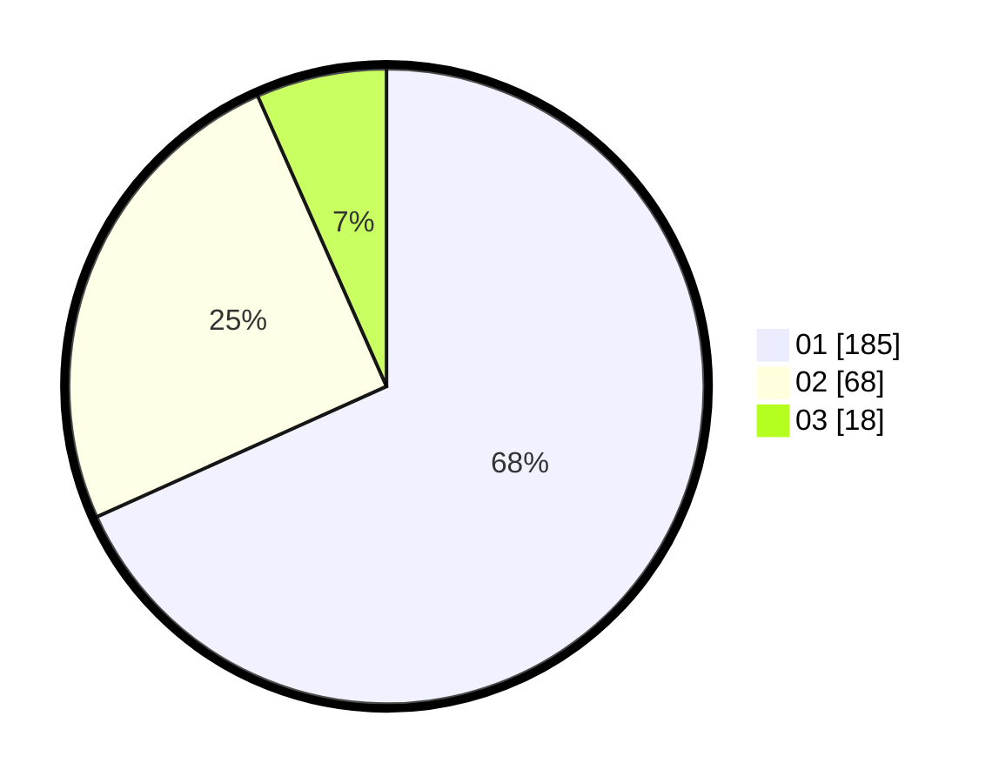

# Hasil

Hasil perolehan suara paslon dapat dilihat pada file paslon-01.txt, paslon-02.txt, dan paslon-03.txt.

Jika tidak ada, artinya data tersebut belum ada pada SIREKAP.

## Perolehan Suara

 * Paslon 01: **185**.
 * Paslon 02: **68**.
 * Paslon 03: **18**.

## Foto C Plano

https://sirekap-obj-formc.kpu.go.id/beb2/pemilu/ppwp/31/75/03/10/02/3175031002121-20240214-205335--61527ddc-5500-4743-b30a-b3532a0229c0.jpg

https://sirekap-obj-formc.kpu.go.id/beb2/pemilu/ppwp/31/75/03/10/02/3175031002121-20240214-205442--54702401-a934-4aa6-b283-980e5cc99102.jpg

https://sirekap-obj-formc.kpu.go.id/beb2/pemilu/ppwp/31/75/03/10/02/3175031002121-20240214-205604--f1730d71-e285-47b8-9c7d-56f03cd1a34e.jpg
