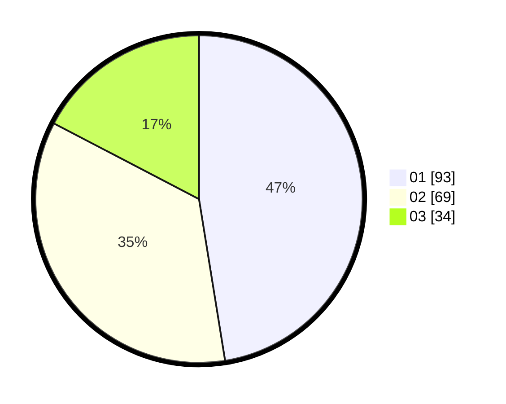

# Hasil

Hasil perolehan suara paslon dapat dilihat pada file paslon-01.txt, paslon-02.txt, dan paslon-03.txt.

Jika tidak ada, artinya data tersebut belum ada pada SIREKAP.

## Perolehan Suara

 * Paslon 01: **93**.
 * Paslon 02: **69**.
 * Paslon 03: **34**.

## Foto C Plano

https://sirekap-obj-formc.kpu.go.id/d852/pemilu/ppwp/31/75/03/10/02/3175031002123-20240214-194623--9dd34bb1-58d2-4943-9c38-60f2908d909e.jpg

https://sirekap-obj-formc.kpu.go.id/d852/pemilu/ppwp/31/75/03/10/02/3175031002123-20240214-200859--aed747e9-ca54-4c31-a1e5-25af095ca1f7.jpg

https://sirekap-obj-formc.kpu.go.id/d852/pemilu/ppwp/31/75/03/10/02/3175031002123-20240214-200300--71051783-6e09-430f-bbfb-3c4242f8a86f.jpg

## DATA PEMILIH TETAP

Jumlah pemilih dalam DPT: **289**.
 * L: **136**.
 * P: **153**.

## DATA PENGGUNA HAK PILIH

Jumlah pengguna hak pilih dalam DPT: **176**.
 * L: **75**.
 * P: **101**.

Jumlah pengguna hak pilih dalam DPTb: **21**.
 * L: **5**.
 * P: **16**.

Jumlah pengguna hak pilih dalam DPK: **1**.
 * L: **0**.
 * P: **1**.

Jumlah pengguna hak pilih: **198**.
 * L: **80**.
 * P: **118**.

## JUMLAH SUARA SAH DAN TIDAK SAH

JUMLAH SELURUH SUARA SAH: **196**.

JUMLAH SUARA TIDAK SAH: **2**.

JUMLAH SELURUH SUARA SAH DAN SUARA TIDAK SAH: **198**.
