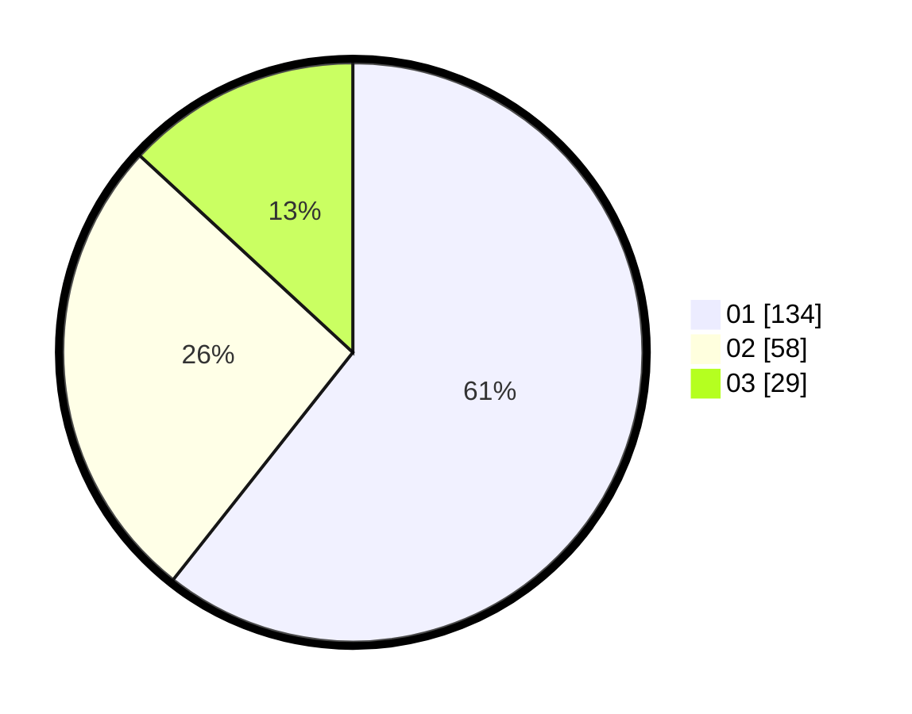

# Hasil

Hasil perolehan suara paslon dapat dilihat pada file paslon-01.txt, paslon-02.txt, dan paslon-03.txt.

Jika tidak ada, artinya data tersebut belum ada pada SIREKAP.

## Perolehan Suara

 * Paslon 01: **134**.
 * Paslon 02: **58**.
 * Paslon 03: **29**.

## Foto C Plano

https://sirekap-obj-formc.kpu.go.id/3600/pemilu/ppwp/31/75/03/10/03/3175031003001-20240214-155656--4d75e597-a180-43b8-9782-8f5fbc9b747f.jpg

https://sirekap-obj-formc.kpu.go.id/3600/pemilu/ppwp/31/75/03/10/03/3175031003001-20240216-143705--361f8c35-330d-4772-ac57-0dab0a23959d.jpg

https://sirekap-obj-formc.kpu.go.id/3600/pemilu/ppwp/31/75/03/10/03/3175031003001-20240216-143705--32fdd19c-a995-4fd9-b56f-a4763b752039.jpg

## DATA PEMILIH TETAP

Jumlah pemilih dalam DPT: **266**.
 * L: **128**.
 * P: **138**.

## DATA PENGGUNA HAK PILIH

Jumlah pengguna hak pilih dalam DPT: **210**.
 * L: **101**.
 * P: **109**.

Jumlah pengguna hak pilih dalam DPTb: **8**.
 * L: **3**.
 * P: **5**.

Jumlah pengguna hak pilih dalam DPK: **6**.
 * L: **2**.
 * P: **4**.

Jumlah pengguna hak pilih: **224**.
 * L: **106**.
 * P: **118**.

## JUMLAH SUARA SAH DAN TIDAK SAH

JUMLAH SELURUH SUARA SAH: **0**.

JUMLAH SUARA TIDAK SAH: **3**.

JUMLAH SELURUH SUARA SAH DAN SUARA TIDAK SAH: **224**.
