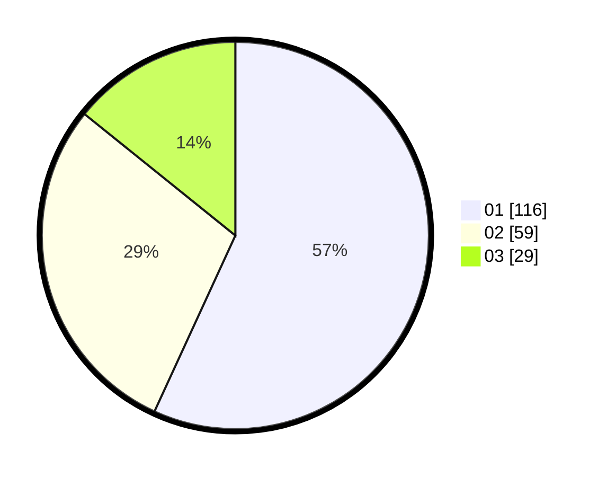

# Hasil

Hasil perolehan suara paslon dapat dilihat pada file paslon-01.txt, paslon-02.txt, dan paslon-03.txt.

Jika tidak ada, artinya data tersebut belum ada pada SIREKAP.

## Perolehan Suara

 * Paslon 01: **116**.
 * Paslon 02: **59**.
 * Paslon 03: **29**.

## Foto C Plano

https://sirekap-obj-formc.kpu.go.id/a22b/pemilu/ppwp/31/75/03/10/03/3175031003002-20240214-215158--3f4b72ca-255b-4cff-aae7-4a75eb7fac03.jpg

https://sirekap-obj-formc.kpu.go.id/a22b/pemilu/ppwp/31/75/03/10/03/3175031003002-20240214-215436--f9d0dbb9-abea-4722-b7d0-8ee53c6ce73a.jpg

https://sirekap-obj-formc.kpu.go.id/a22b/pemilu/ppwp/31/75/03/10/03/3175031003002-20240214-215659--0ccec7d6-4d37-4380-83f3-42b2523e7129.jpg
