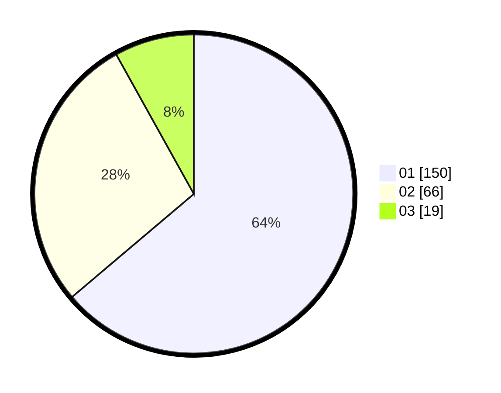

# Hasil

Hasil perolehan suara paslon dapat dilihat pada file paslon-01.txt, paslon-02.txt, dan paslon-03.txt.

Jika tidak ada, artinya data tersebut belum ada pada SIREKAP.

## Perolehan Suara

 * Paslon 01: **150**.
 * Paslon 02: **66**.
 * Paslon 03: **19**.

## Foto C Plano

https://sirekap-obj-formc.kpu.go.id/111f/pemilu/ppwp/31/75/03/10/03/3175031003003-20240215-220200--0ebe1ad6-21e5-4904-b0a4-d428ae1a4e5c.jpg

https://sirekap-obj-formc.kpu.go.id/111f/pemilu/ppwp/31/75/03/10/03/3175031003003-20240215-220202--e5415226-a8f6-4691-9d5c-a26fde39583d.jpg

https://sirekap-obj-formc.kpu.go.id/111f/pemilu/ppwp/31/75/03/10/03/3175031003003-20240215-220200--a3f39c6f-382d-4863-b4b7-d5d64f56fc1c.jpg

## DATA PEMILIH TETAP

Jumlah pemilih dalam DPT: **267**.
 * L: **122**.
 * P: **145**.

## DATA PENGGUNA HAK PILIH

Jumlah pengguna hak pilih dalam DPT: **234**.
 * L: **112**.
 * P: **122**.

Jumlah pengguna hak pilih dalam DPTb: **0**.
 * L: **0**.
 * P: **0**.

Jumlah pengguna hak pilih dalam DPK: **2**.
 * L: **1**.
 * P: **1**.

Jumlah pengguna hak pilih: **236**.
 * L: **113**.
 * P: **123**.

## JUMLAH SUARA SAH DAN TIDAK SAH

JUMLAH SELURUH SUARA SAH: **233**.

JUMLAH SUARA TIDAK SAH: **3**.

JUMLAH SELURUH SUARA SAH DAN SUARA TIDAK SAH: **236**.
