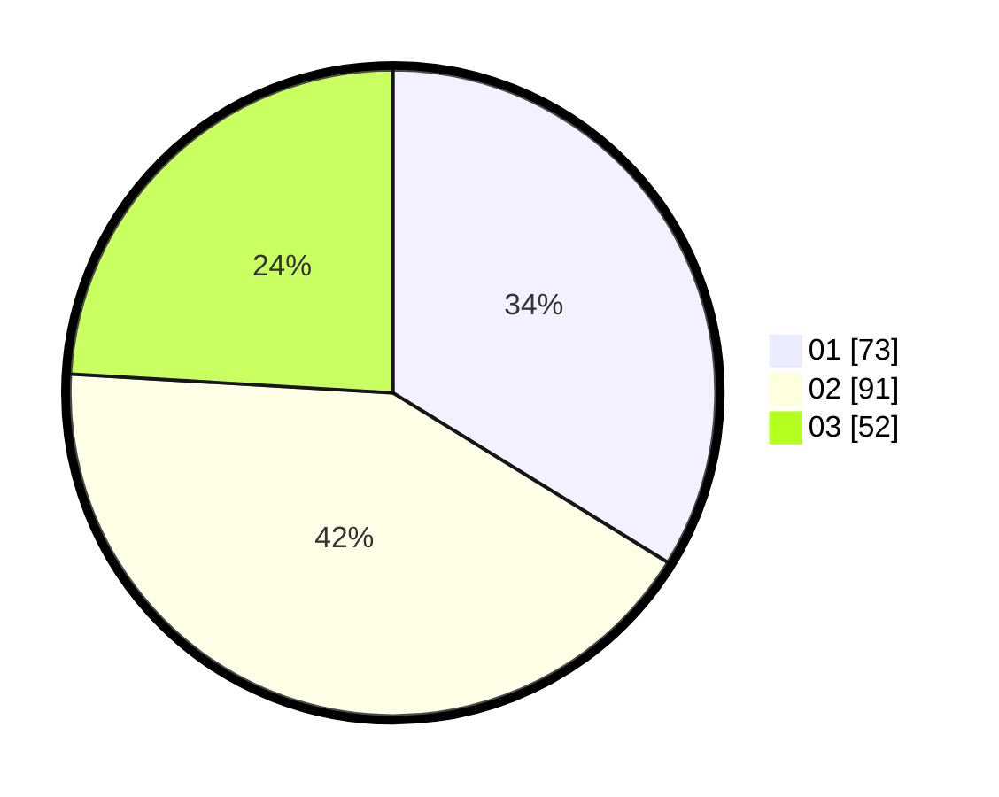

# Hasil

Hasil perolehan suara paslon dapat dilihat pada file paslon-01.txt, paslon-02.txt, dan paslon-03.txt.

Jika tidak ada, artinya data tersebut belum ada pada SIREKAP.

## Perolehan Suara

 * Paslon 01: **73**.
 * Paslon 02: **91**.
 * Paslon 03: **52**.

## Foto C Plano

https://sirekap-obj-formc.kpu.go.id/25fb/pemilu/ppwp/31/75/03/10/03/3175031003009-20240216-035439--cb6bef2c-ca28-4149-a33f-1fee502864bc.jpg

https://sirekap-obj-formc.kpu.go.id/25fb/pemilu/ppwp/31/75/03/10/03/3175031003009-20240216-035445--29367853-dabc-4edf-a8f7-c67204a3b427.jpg

https://sirekap-obj-formc.kpu.go.id/25fb/pemilu/ppwp/31/75/03/10/03/3175031003009-20240216-035441--6ec7b457-e166-462d-98ef-abb8556e350d.jpg

## DATA PEMILIH TETAP

Jumlah pemilih dalam DPT: **258**.
 * L: **123**.
 * P: **135**.

## DATA PENGGUNA HAK PILIH

Jumlah pengguna hak pilih dalam DPT: **192**.
 * L: **88**.
 * P: **104**.

Jumlah pengguna hak pilih dalam DPTb: **20**.
 * L: **11**.
 * P: **9**.

Jumlah pengguna hak pilih dalam DPK: **7**.
 * L: **0**.
 * P: **7**.

Jumlah pengguna hak pilih: **219**.
 * L: **99**.
 * P: **120**.

## JUMLAH SUARA SAH DAN TIDAK SAH

JUMLAH SELURUH SUARA SAH: **216**.

JUMLAH SUARA TIDAK SAH: **3**.

JUMLAH SELURUH SUARA SAH DAN SUARA TIDAK SAH: **219**.
