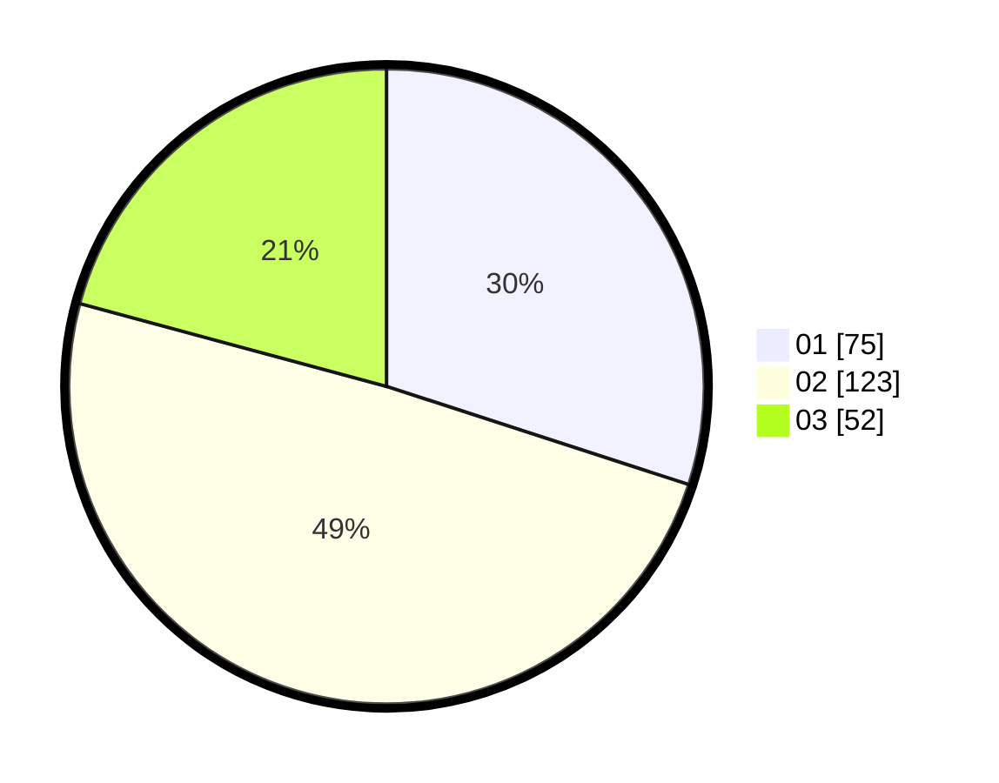

# Hasil

Hasil perolehan suara paslon dapat dilihat pada file paslon-01.txt, paslon-02.txt, dan paslon-03.txt.

Jika tidak ada, artinya data tersebut belum ada pada SIREKAP.

## Perolehan Suara

 * Paslon 01: **75**.
 * Paslon 02: **123**.
 * Paslon 03: **52**.

## Foto C Plano

https://sirekap-obj-formc.kpu.go.id/a652/pemilu/ppwp/31/75/03/10/03/3175031003014-20240214-231858--5feade1f-780d-4bf5-bd4b-f09e447a433e.jpg

https://sirekap-obj-formc.kpu.go.id/a652/pemilu/ppwp/31/75/03/10/03/3175031003014-20240214-233059--586b07ea-36b5-4fa5-a615-c83c05d5731e.jpg

https://sirekap-obj-formc.kpu.go.id/a652/pemilu/ppwp/31/75/03/10/03/3175031003014-20240214-233155--2982de30-88c1-4125-a885-24745729321b.jpg

## DATA PEMILIH TETAP

Jumlah pemilih dalam DPT: **288**.
 * L: **140**.
 * P: **148**.

## DATA PENGGUNA HAK PILIH

Jumlah pengguna hak pilih dalam DPT: **237**.
 * L: **113**.
 * P: **124**.

Jumlah pengguna hak pilih dalam DPTb: **17**.
 * L: **3**.
 * P: **14**.

Jumlah pengguna hak pilih dalam DPK: **1**.
 * L: **0**.
 * P: **1**.

Jumlah pengguna hak pilih: **255**.
 * L: **116**.
 * P: **139**.

## JUMLAH SUARA SAH DAN TIDAK SAH

JUMLAH SELURUH SUARA SAH: **250**.

JUMLAH SUARA TIDAK SAH: **5**.

JUMLAH SELURUH SUARA SAH DAN SUARA TIDAK SAH: **255**.
