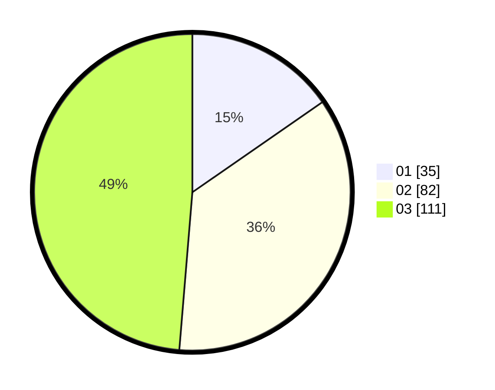

# Hasil

Hasil perolehan suara paslon dapat dilihat pada file paslon-01.txt, paslon-02.txt, dan paslon-03.txt.

Jika tidak ada, artinya data tersebut belum ada pada SIREKAP.

## Perolehan Suara

 * Paslon 01: **35**.
 * Paslon 02: **82**.
 * Paslon 03: **111**.

## Foto C Plano

https://sirekap-obj-formc.kpu.go.id/d7af/pemilu/ppwp/31/75/03/10/03/3175031003017-20240214-155042--f9d5d06d-c6d4-41fb-850b-760d4f68c5d7.jpg

https://sirekap-obj-formc.kpu.go.id/d7af/pemilu/ppwp/31/75/03/10/03/3175031003017-20240214-155133--ee808bb0-9e11-47f3-a4da-ef41e1b20138.jpg

https://sirekap-obj-formc.kpu.go.id/d7af/pemilu/ppwp/31/75/03/10/03/3175031003017-20240214-155251--d79cea2d-ac62-4052-9f56-ce24971c8002.jpg

## DATA PEMILIH TETAP

Jumlah pemilih dalam DPT: **288**.
 * L: **141**.
 * P: **147**.

## DATA PENGGUNA HAK PILIH

Jumlah pengguna hak pilih dalam DPT: **221**.
 * L: **110**.
 * P: **111**.

Jumlah pengguna hak pilih dalam DPTb: **9**.
 * L: **5**.
 * P: **4**.

Jumlah pengguna hak pilih dalam DPK: **1**.
 * L: **0**.
 * P: **1**.

Jumlah pengguna hak pilih: **231**.
 * L: **115**.
 * P: **116**.

## JUMLAH SUARA SAH DAN TIDAK SAH

JUMLAH SELURUH SUARA SAH: **228**.

JUMLAH SUARA TIDAK SAH: **3**.

JUMLAH SELURUH SUARA SAH DAN SUARA TIDAK SAH: **231**.
