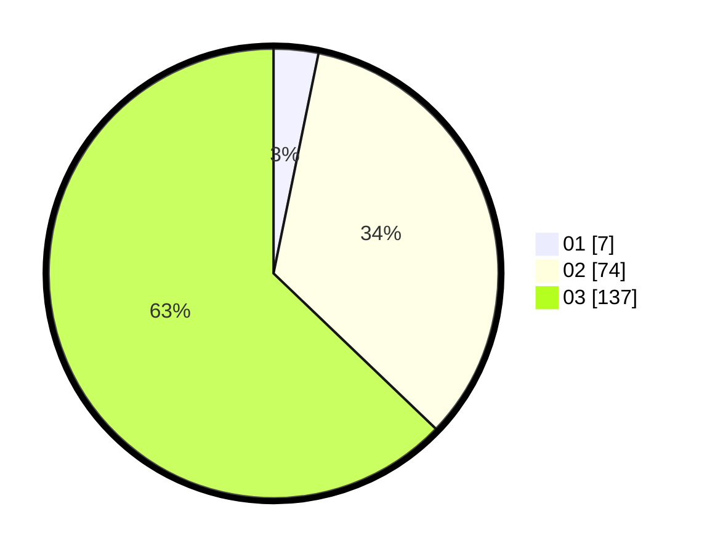

# Hasil

Hasil perolehan suara paslon dapat dilihat pada file paslon-01.txt, paslon-02.txt, dan paslon-03.txt.

Jika tidak ada, artinya data tersebut belum ada pada SIREKAP.

## Perolehan Suara

 * Paslon 01: **7**.
 * Paslon 02: **74**.
 * Paslon 03: **137**.

## Foto C Plano

https://sirekap-obj-formc.kpu.go.id/b7b8/pemilu/ppwp/31/75/03/10/03/3175031003021-20240214-155336--d6944bc2-b4fd-4261-9c7c-bb3057d8c0ab.jpg

https://sirekap-obj-formc.kpu.go.id/b7b8/pemilu/ppwp/31/75/03/10/03/3175031003021-20240214-155517--3e574313-ca1d-4ae3-926f-111389f639c6.jpg

https://sirekap-obj-formc.kpu.go.id/b7b8/pemilu/ppwp/31/75/03/10/03/3175031003021-20240214-155711--4c4c2550-f38c-4f63-8815-8d4a3bd84148.jpg

## DATA PEMILIH TETAP

Jumlah pemilih dalam DPT: **283**.
 * L: **133**.
 * P: **150**.

## DATA PENGGUNA HAK PILIH

Jumlah pengguna hak pilih dalam DPT: **216**.
 * L: **105**.
 * P: **111**.

Jumlah pengguna hak pilih dalam DPTb: **0**.
 * L: **0**.
 * P: **0**.

Jumlah pengguna hak pilih dalam DPK: **4**.
 * L: **2**.
 * P: **2**.

Jumlah pengguna hak pilih: **220**.
 * L: **107**.
 * P: **113**.

## JUMLAH SUARA SAH DAN TIDAK SAH

JUMLAH SELURUH SUARA SAH: **218**.

JUMLAH SUARA TIDAK SAH: **2**.

JUMLAH SELURUH SUARA SAH DAN SUARA TIDAK SAH: **220**.
