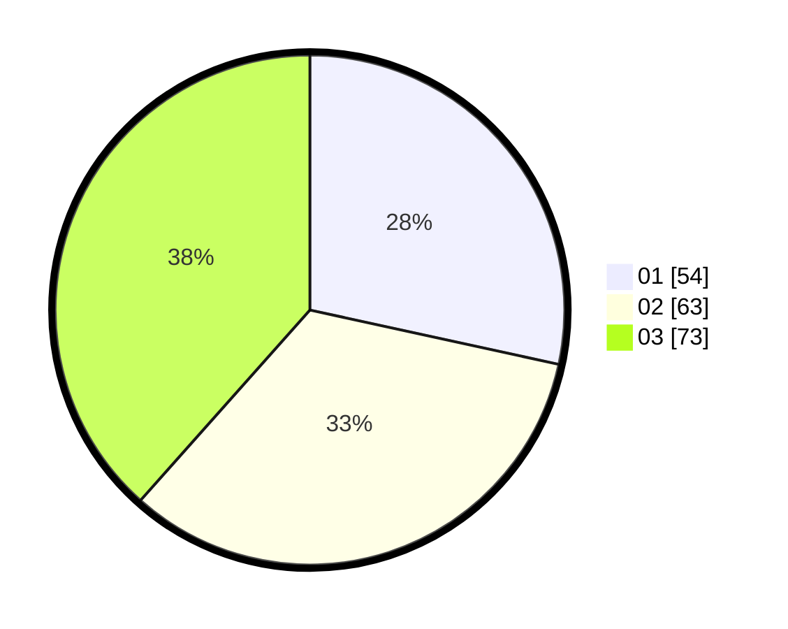

# Hasil

Hasil perolehan suara paslon dapat dilihat pada file paslon-01.txt, paslon-02.txt, dan paslon-03.txt.

Jika tidak ada, artinya data tersebut belum ada pada SIREKAP.

## Perolehan Suara

 * Paslon 01: **54**.
 * Paslon 02: **63**.
 * Paslon 03: **73**.

## Foto C Plano

https://sirekap-obj-formc.kpu.go.id/3094/pemilu/ppwp/31/75/03/10/03/3175031003022-20240216-070546--11a12f53-3dd6-474c-90ee-02792b381413.jpg

https://sirekap-obj-formc.kpu.go.id/3094/pemilu/ppwp/31/75/03/10/03/3175031003022-20240216-070548--b1a4782f-8aca-4401-9826-69f592eaff6a.jpg

https://sirekap-obj-formc.kpu.go.id/3094/pemilu/ppwp/31/75/03/10/03/3175031003022-20240216-070547--72f9b631-37b0-4c71-9f7b-9c9d98f4ff3d.jpg

## DATA PEMILIH TETAP

Jumlah pemilih dalam DPT: **256**.
 * L: **123**.
 * P: **133**.

## DATA PENGGUNA HAK PILIH

Jumlah pengguna hak pilih dalam DPT: **195**.
 * L: **92**.
 * P: **103**.

Jumlah pengguna hak pilih dalam DPTb: **0**.
 * L: **0**.
 * P: **0**.

Jumlah pengguna hak pilih dalam DPK: **0**.
 * L: **0**.
 * P: **0**.

Jumlah pengguna hak pilih: **195**.
 * L: **92**.
 * P: **103**.

## JUMLAH SUARA SAH DAN TIDAK SAH

JUMLAH SELURUH SUARA SAH: **190**.

JUMLAH SUARA TIDAK SAH: **5**.

JUMLAH SELURUH SUARA SAH DAN SUARA TIDAK SAH: **195**.
