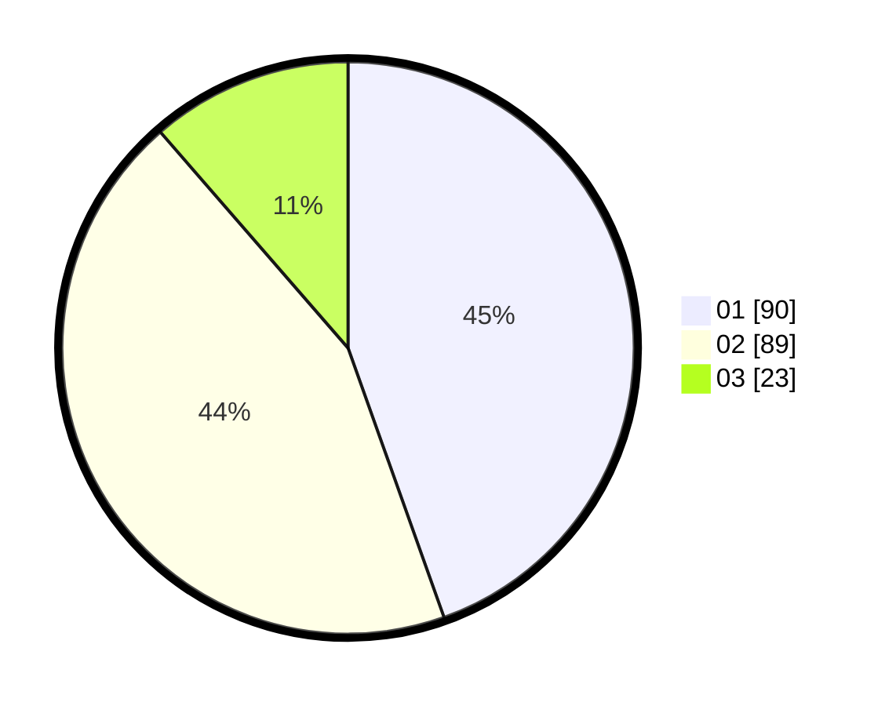

# Hasil

Hasil perolehan suara paslon dapat dilihat pada file paslon-01.txt, paslon-02.txt, dan paslon-03.txt.

Jika tidak ada, artinya data tersebut belum ada pada SIREKAP.

## Perolehan Suara

 * Paslon 01: **90**.
 * Paslon 02: **89**.
 * Paslon 03: **23**.

## Foto C Plano

https://sirekap-obj-formc.kpu.go.id/733c/pemilu/ppwp/31/75/03/10/03/3175031003023-20240215-010448--b920397f-25ad-4814-9753-3a4bed3d9cbd.jpg

https://sirekap-obj-formc.kpu.go.id/733c/pemilu/ppwp/31/75/03/10/03/3175031003023-20240215-010529--987c9a95-d0d7-4fa5-a572-0ddc53e6fbe7.jpg

https://sirekap-obj-formc.kpu.go.id/733c/pemilu/ppwp/31/75/03/10/03/3175031003023-20240215-010605--ea4b5c13-a16b-4e4d-bc64-a668336821f2.jpg

## DATA PEMILIH TETAP

Jumlah pemilih dalam DPT: **254**.
 * L: **145**.
 * P: **109**.

## DATA PENGGUNA HAK PILIH

Jumlah pengguna hak pilih dalam DPT: **200**.
 * L: **113**.
 * P: **87**.

Jumlah pengguna hak pilih dalam DPTb: **4**.
 * L: **2**.
 * P: **2**.

Jumlah pengguna hak pilih dalam DPK: **2**.
 * L: **1**.
 * P: **1**.

Jumlah pengguna hak pilih: **206**.
 * L: **116**.
 * P: **90**.

## JUMLAH SUARA SAH DAN TIDAK SAH

JUMLAH SELURUH SUARA SAH: **202**.

JUMLAH SUARA TIDAK SAH: **4**.

JUMLAH SELURUH SUARA SAH DAN SUARA TIDAK SAH: **206**.
