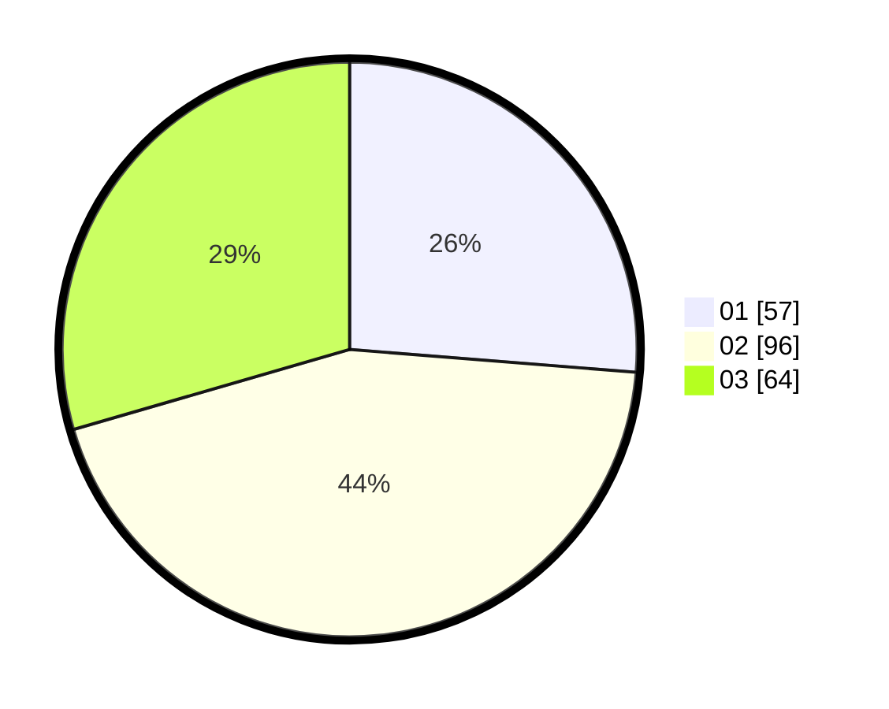

# Hasil

Hasil perolehan suara paslon dapat dilihat pada file paslon-01.txt, paslon-02.txt, dan paslon-03.txt.

Jika tidak ada, artinya data tersebut belum ada pada SIREKAP.

## Perolehan Suara

 * Paslon 01: **57**.
 * Paslon 02: **96**.
 * Paslon 03: **64**.

## Foto C Plano

https://sirekap-obj-formc.kpu.go.id/052e/pemilu/ppwp/31/75/03/10/03/3175031003025-20240215-213215--fa3bc925-7629-4700-8b0b-212af50d1b7f.jpg

https://sirekap-obj-formc.kpu.go.id/052e/pemilu/ppwp/31/75/03/10/03/3175031003025-20240215-213216--d670ca62-c842-4246-b4f2-e03265477455.jpg

https://sirekap-obj-formc.kpu.go.id/052e/pemilu/ppwp/31/75/03/10/03/3175031003025-20240214-191214--7e80eaf8-bcae-4b6a-83bc-85b90e806837.jpg

## DATA PEMILIH TETAP

Jumlah pemilih dalam DPT: **269**.
 * L: **139**.
 * P: **130**.

## DATA PENGGUNA HAK PILIH

Jumlah pengguna hak pilih dalam DPT: **215**.
 * L: **111**.
 * P: **104**.

Jumlah pengguna hak pilih dalam DPTb: **0**.
 * L: **0**.
 * P: **0**.

Jumlah pengguna hak pilih dalam DPK: **2**.
 * L: **0**.
 * P: **2**.

Jumlah pengguna hak pilih: **217**.
 * L: **111**.
 * P: **106**.

## JUMLAH SUARA SAH DAN TIDAK SAH

JUMLAH SELURUH SUARA SAH: **217**.

JUMLAH SUARA TIDAK SAH: **0**.

JUMLAH SELURUH SUARA SAH DAN SUARA TIDAK SAH: **217**.
