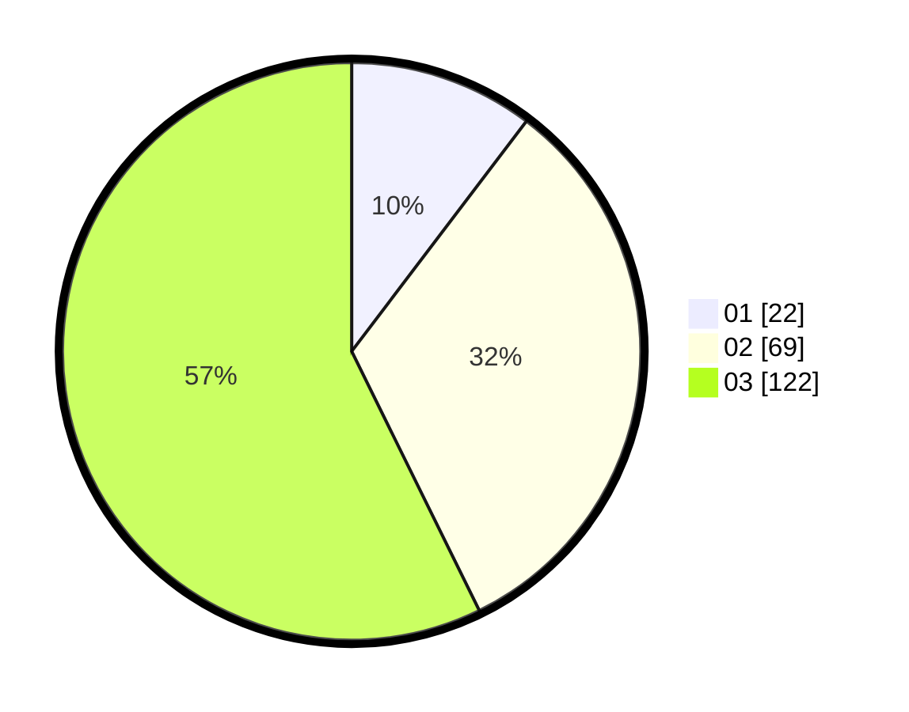

# Hasil

Hasil perolehan suara paslon dapat dilihat pada file paslon-01.txt, paslon-02.txt, dan paslon-03.txt.

Jika tidak ada, artinya data tersebut belum ada pada SIREKAP.

## Perolehan Suara

 * Paslon 01: **22**.
 * Paslon 02: **69**.
 * Paslon 03: **122**.

## Foto C Plano

https://sirekap-obj-formc.kpu.go.id/418b/pemilu/ppwp/31/75/03/10/03/3175031003029-20240215-014211--9fc09f9c-c06b-44be-af92-291257e6fb32.jpg

https://sirekap-obj-formc.kpu.go.id/418b/pemilu/ppwp/31/75/03/10/03/3175031003029-20240214-211432--45930949-a6c3-400c-afb7-7cdeeb227343.jpg
