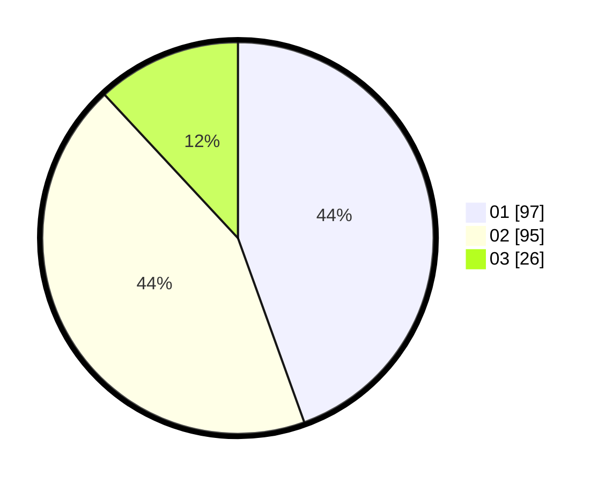

# Hasil

Hasil perolehan suara paslon dapat dilihat pada file paslon-01.txt, paslon-02.txt, dan paslon-03.txt.

Jika tidak ada, artinya data tersebut belum ada pada SIREKAP.

## Perolehan Suara

 * Paslon 01: **97**.
 * Paslon 02: **95**.
 * Paslon 03: **26**.

## Foto C Plano

https://sirekap-obj-formc.kpu.go.id/23f5/pemilu/ppwp/31/75/03/10/03/3175031003031-20240216-144204--a6679029-cc73-4101-ad23-ffdf874dc177.jpg

https://sirekap-obj-formc.kpu.go.id/23f5/pemilu/ppwp/31/75/03/10/03/3175031003031-20240216-144206--5bb2d008-bfcf-4491-9f94-213cc7222101.jpg

https://sirekap-obj-formc.kpu.go.id/23f5/pemilu/ppwp/31/75/03/10/03/3175031003031-20240216-144205--0282c95d-0de9-4817-8f13-72b93ab7684e.jpg

## DATA PEMILIH TETAP

Jumlah pemilih dalam DPT: **0**.
 * L: **0**.
 * P: **0**.

## DATA PENGGUNA HAK PILIH

Jumlah pengguna hak pilih dalam DPT: **0**.
 * L: **0**.
 * P: **0**.

Jumlah pengguna hak pilih dalam DPTb: **0**.
 * L: **0**.
 * P: **0**.

Jumlah pengguna hak pilih dalam DPK: **0**.
 * L: **0**.
 * P: **0**.

Jumlah pengguna hak pilih: **0**.
 * L: **0**.
 * P: **0**.

## JUMLAH SUARA SAH DAN TIDAK SAH

JUMLAH SELURUH SUARA SAH: **219**.

JUMLAH SUARA TIDAK SAH: **5**.

JUMLAH SELURUH SUARA SAH DAN SUARA TIDAK SAH: **224**.
