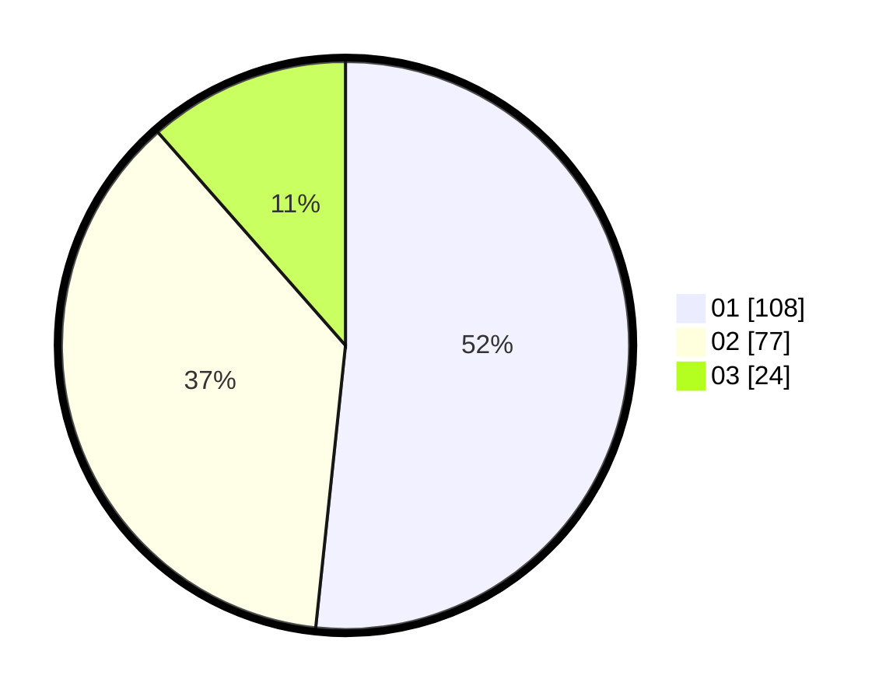

# Hasil

Hasil perolehan suara paslon dapat dilihat pada file paslon-01.txt, paslon-02.txt, dan paslon-03.txt.

Jika tidak ada, artinya data tersebut belum ada pada SIREKAP.

## Perolehan Suara

 * Paslon 01: **108**.
 * Paslon 02: **77**.
 * Paslon 03: **24**.

## Foto C Plano

https://sirekap-obj-formc.kpu.go.id/9687/pemilu/ppwp/31/75/03/10/04/3175031004033-20240214-224020--9eb5639c-e231-44cf-bcfa-8f85dec27c33.jpg

https://sirekap-obj-formc.kpu.go.id/9687/pemilu/ppwp/31/75/03/10/04/3175031004033-20240214-235338--cd1814e4-6e01-4a7e-bb4a-11069da13196.jpg

https://sirekap-obj-formc.kpu.go.id/9687/pemilu/ppwp/31/75/03/10/04/3175031004033-20240214-235608--718511d2-74cc-4948-9a77-529c7d11a798.jpg
