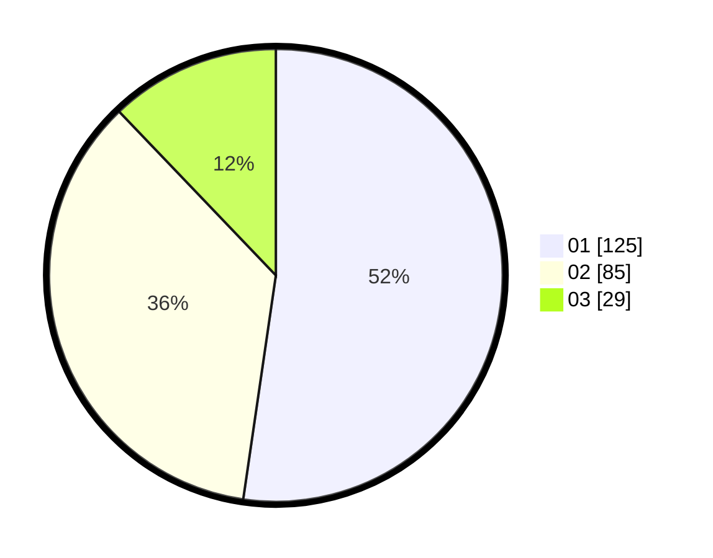

# Hasil

Hasil perolehan suara paslon dapat dilihat pada file paslon-01.txt, paslon-02.txt, dan paslon-03.txt.

Jika tidak ada, artinya data tersebut belum ada pada SIREKAP.

## Perolehan Suara

 * Paslon 01: **125**.
 * Paslon 02: **85**.
 * Paslon 03: **29**.

## Foto C Plano

https://sirekap-obj-formc.kpu.go.id/ee21/pemilu/ppwp/31/75/03/10/04/3175031004072-20240214-213312--25f65abb-3b3c-4b76-8f10-dd534f2ecc9a.jpg

https://sirekap-obj-formc.kpu.go.id/ee21/pemilu/ppwp/31/75/03/10/04/3175031004072-20240214-213425--d3d5f6c7-c8fc-47e3-923f-7c9b2c65950a.jpg

https://sirekap-obj-formc.kpu.go.id/ee21/pemilu/ppwp/31/75/03/10/04/3175031004072-20240214-213512--f34d7865-bcff-4fb0-88be-4e38bcceddd2.jpg

## DATA PEMILIH TETAP

Jumlah pemilih dalam DPT: **273**.
 * L: **134**.
 * P: **139**.

## DATA PENGGUNA HAK PILIH

Jumlah pengguna hak pilih dalam DPT: **239**.
 * L: **116**.
 * P: **123**.

Jumlah pengguna hak pilih dalam DPTb: **3**.
 * L: **0**.
 * P: **3**.

Jumlah pengguna hak pilih dalam DPK: **0**.
 * L: **0**.
 * P: **0**.

Jumlah pengguna hak pilih: **242**.
 * L: **116**.
 * P: **126**.

## JUMLAH SUARA SAH DAN TIDAK SAH

JUMLAH SELURUH SUARA SAH: **239**.

JUMLAH SUARA TIDAK SAH: **3**.

JUMLAH SELURUH SUARA SAH DAN SUARA TIDAK SAH: **242**.
