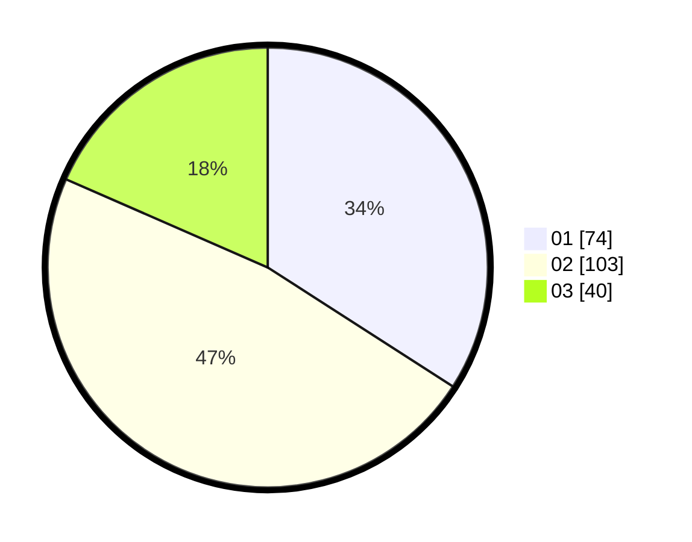

# Hasil

Hasil perolehan suara paslon dapat dilihat pada file paslon-01.txt, paslon-02.txt, dan paslon-03.txt.

Jika tidak ada, artinya data tersebut belum ada pada SIREKAP.

## Perolehan Suara

 * Paslon 01: **74**.
 * Paslon 02: **103**.
 * Paslon 03: **40**.

## Foto C Plano

https://sirekap-obj-formc.kpu.go.id/82bf/pemilu/ppwp/31/75/03/10/05/3175031005002-20240214-155230--fac5a243-7cc5-4881-9094-3e5940d5e679.jpg

https://sirekap-obj-formc.kpu.go.id/82bf/pemilu/ppwp/31/75/03/10/05/3175031005002-20240214-155108--90caf4a3-e014-42f6-8467-999b209ea323.jpg

https://sirekap-obj-formc.kpu.go.id/82bf/pemilu/ppwp/31/75/03/10/05/3175031005002-20240214-155114--2f75cd96-8f6b-4566-89b4-33093ee61e15.jpg

## DATA PEMILIH TETAP

Jumlah pemilih dalam DPT: **267**.
 * L: **127**.
 * P: **140**.

## DATA PENGGUNA HAK PILIH

Jumlah pengguna hak pilih dalam DPT: **212**.
 * L: **115**.
 * P: **97**.

Jumlah pengguna hak pilih dalam DPTb: **4**.
 * L: **2**.
 * P: **2**.

Jumlah pengguna hak pilih dalam DPK: **2**.
 * L: **1**.
 * P: **1**.

Jumlah pengguna hak pilih: **218**.
 * L: **118**.
 * P: **100**.

## JUMLAH SUARA SAH DAN TIDAK SAH

JUMLAH SELURUH SUARA SAH: **217**.

JUMLAH SUARA TIDAK SAH: **1**.

JUMLAH SELURUH SUARA SAH DAN SUARA TIDAK SAH: **218**.
