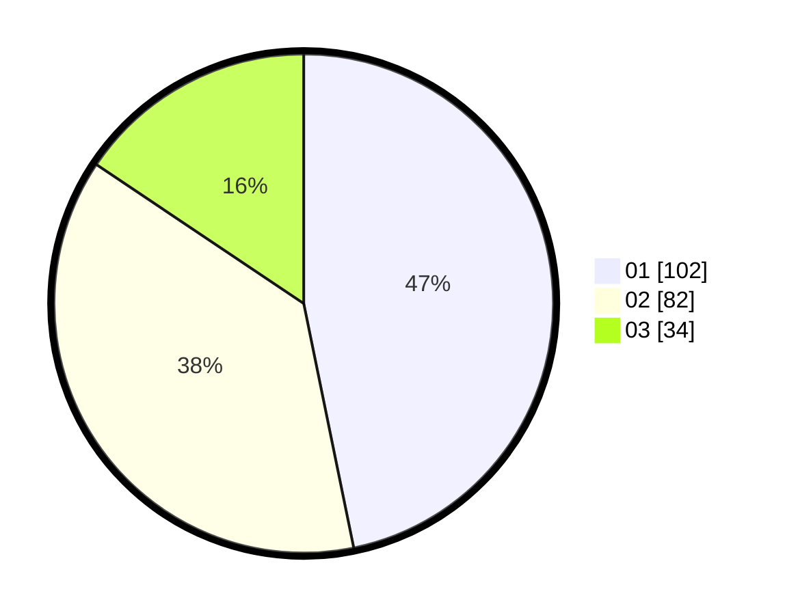

# Hasil

Hasil perolehan suara paslon dapat dilihat pada file paslon-01.txt, paslon-02.txt, dan paslon-03.txt.

Jika tidak ada, artinya data tersebut belum ada pada SIREKAP.

## Perolehan Suara

 * Paslon 01: **102**.
 * Paslon 02: **82**.
 * Paslon 03: **34**.

## Foto C Plano

https://sirekap-obj-formc.kpu.go.id/5971/pemilu/ppwp/31/75/03/10/05/3175031005003-20240215-070710--6b258883-c5f8-4d7f-96a4-ca7b785773d5.jpg

https://sirekap-obj-formc.kpu.go.id/5971/pemilu/ppwp/31/75/03/10/05/3175031005003-20240214-155745--c76274d9-98b0-4686-a011-1cd49d5e32f0.jpg

https://sirekap-obj-formc.kpu.go.id/5971/pemilu/ppwp/31/75/03/10/05/3175031005003-20240215-070728--c4bf9b11-fd85-49dd-a42c-de499756cf6f.jpg

## DATA PEMILIH TETAP

Jumlah pemilih dalam DPT: **264**.
 * L: **128**.
 * P: **136**.

## DATA PENGGUNA HAK PILIH

Jumlah pengguna hak pilih dalam DPT: **210**.
 * L: **100**.
 * P: **110**.

Jumlah pengguna hak pilih dalam DPTb: **12**.
 * L: **2**.
 * P: **10**.

Jumlah pengguna hak pilih dalam DPK: **2**.
 * L: **1**.
 * P: **1**.

Jumlah pengguna hak pilih: **224**.
 * L: **103**.
 * P: **121**.

## JUMLAH SUARA SAH DAN TIDAK SAH

JUMLAH SELURUH SUARA SAH: **218**.

JUMLAH SUARA TIDAK SAH: **6**.

JUMLAH SELURUH SUARA SAH DAN SUARA TIDAK SAH: **224**.
