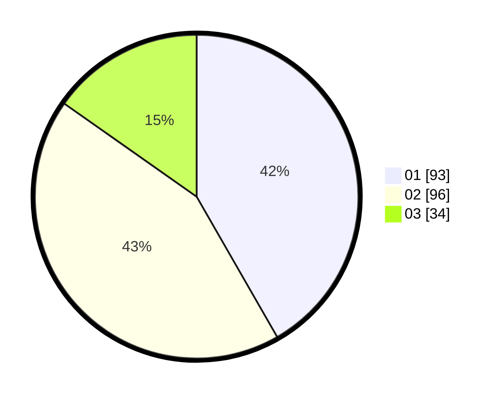

# Hasil

Hasil perolehan suara paslon dapat dilihat pada file paslon-01.txt, paslon-02.txt, dan paslon-03.txt.

Jika tidak ada, artinya data tersebut belum ada pada SIREKAP.

## Perolehan Suara

 * Paslon 01: **93**.
 * Paslon 02: **96**.
 * Paslon 03: **34**.

## Foto C Plano

https://sirekap-obj-formc.kpu.go.id/74a8/pemilu/ppwp/31/75/03/10/05/3175031005005-20240215-181830--ad202f68-678e-48bc-931c-737d5c32e3b3.jpg

https://sirekap-obj-formc.kpu.go.id/74a8/pemilu/ppwp/31/75/03/10/05/3175031005005-20240215-181934--5c878271-e50c-40b7-b001-2cb27572e3f7.jpg

https://sirekap-obj-formc.kpu.go.id/74a8/pemilu/ppwp/31/75/03/10/05/3175031005005-20240215-182041--19d96b8d-acde-4cb3-b035-5ff0e4c7e21b.jpg
