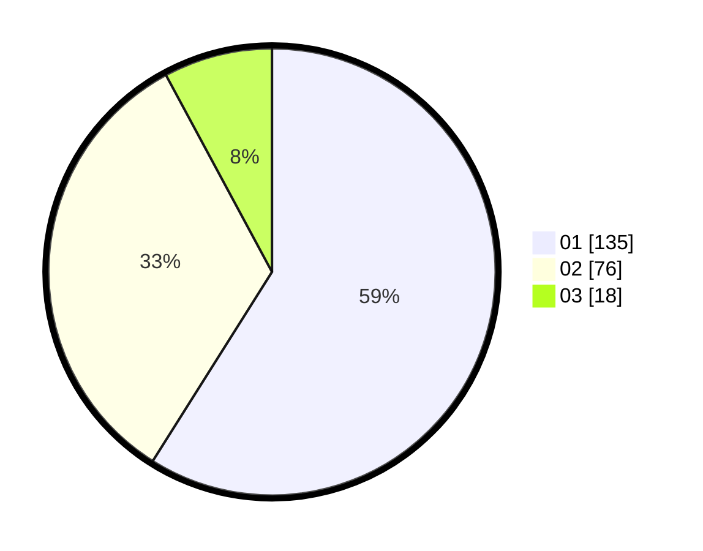

# Hasil

Hasil perolehan suara paslon dapat dilihat pada file paslon-01.txt, paslon-02.txt, dan paslon-03.txt.

Jika tidak ada, artinya data tersebut belum ada pada SIREKAP.

## Perolehan Suara

 * Paslon 01: **135**.
 * Paslon 02: **76**.
 * Paslon 03: **18**.

## Foto C Plano

https://sirekap-obj-formc.kpu.go.id/a278/pemilu/ppwp/31/75/03/10/05/3175031005007-20240216-043314--89e4a540-cee2-469b-ab62-9b7c679db506.jpg

https://sirekap-obj-formc.kpu.go.id/a278/pemilu/ppwp/31/75/03/10/05/3175031005007-20240216-043315--5519c546-1d96-47b2-a30f-f41e763fca92.jpg

https://sirekap-obj-formc.kpu.go.id/a278/pemilu/ppwp/31/75/03/10/05/3175031005007-20240216-043314--e4f25501-d726-4fac-97ef-fa66b8434085.jpg

## DATA PEMILIH TETAP

Jumlah pemilih dalam DPT: **273**.
 * L: **136**.
 * P: **137**.

## DATA PENGGUNA HAK PILIH

Jumlah pengguna hak pilih dalam DPT: **231**.
 * L: **112**.
 * P: **119**.

Jumlah pengguna hak pilih dalam DPTb: **1**.
 * L: **0**.
 * P: **1**.

Jumlah pengguna hak pilih dalam DPK: **0**.
 * L: **0**.
 * P: **0**.

Jumlah pengguna hak pilih: **232**.
 * L: **112**.
 * P: **120**.

## JUMLAH SUARA SAH DAN TIDAK SAH

JUMLAH SELURUH SUARA SAH: **229**.

JUMLAH SUARA TIDAK SAH: **3**.

JUMLAH SELURUH SUARA SAH DAN SUARA TIDAK SAH: **232**.
