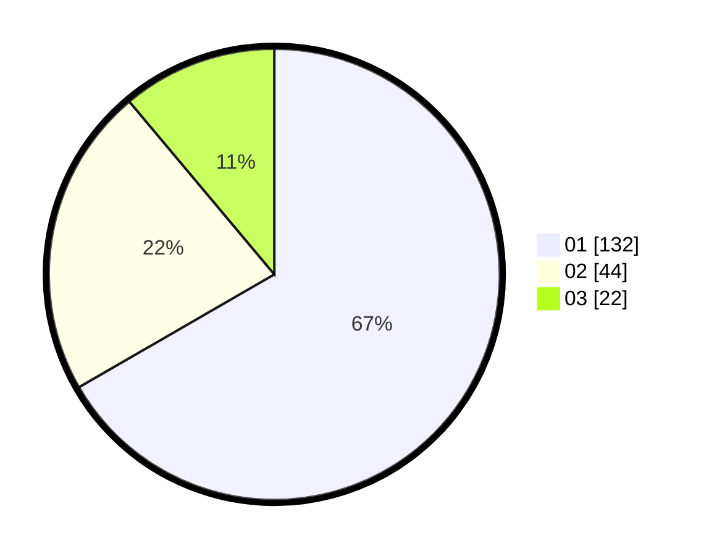

# Hasil

Hasil perolehan suara paslon dapat dilihat pada file paslon-01.txt, paslon-02.txt, dan paslon-03.txt.

Jika tidak ada, artinya data tersebut belum ada pada SIREKAP.

## Perolehan Suara

 * Paslon 01: **132**.
 * Paslon 02: **44**.
 * Paslon 03: **22**.

## Foto C Plano

https://sirekap-obj-formc.kpu.go.id/49b8/pemilu/ppwp/31/75/03/10/05/3175031005008-20240214-184749--b8cbb2bd-024e-432b-8dab-098f4c04f654.jpg

https://sirekap-obj-formc.kpu.go.id/49b8/pemilu/ppwp/31/75/03/10/05/3175031005008-20240214-162222--fce7f5ee-6c59-41db-80bb-58e8371206f7.jpg

https://sirekap-obj-formc.kpu.go.id/49b8/pemilu/ppwp/31/75/03/10/05/3175031005008-20240214-184805--f2c0131e-7478-4491-a77a-d197e998f306.jpg

## DATA PEMILIH TETAP

Jumlah pemilih dalam DPT: **274**.
 * L: **143**.
 * P: **134**.

## DATA PENGGUNA HAK PILIH

Jumlah pengguna hak pilih dalam DPT: **222**.
 * L: **111**.
 * P: **111**.

Jumlah pengguna hak pilih dalam DPTb: **5**.
 * L: **3**.
 * P: **2**.

Jumlah pengguna hak pilih dalam DPK: **5**.
 * L: **2**.
 * P: **3**.

Jumlah pengguna hak pilih: **232**.
 * L: **116**.
 * P: **116**.

## JUMLAH SUARA SAH DAN TIDAK SAH

JUMLAH SELURUH SUARA SAH: **229**.

JUMLAH SUARA TIDAK SAH: **3**.

JUMLAH SELURUH SUARA SAH DAN SUARA TIDAK SAH: **232**.
