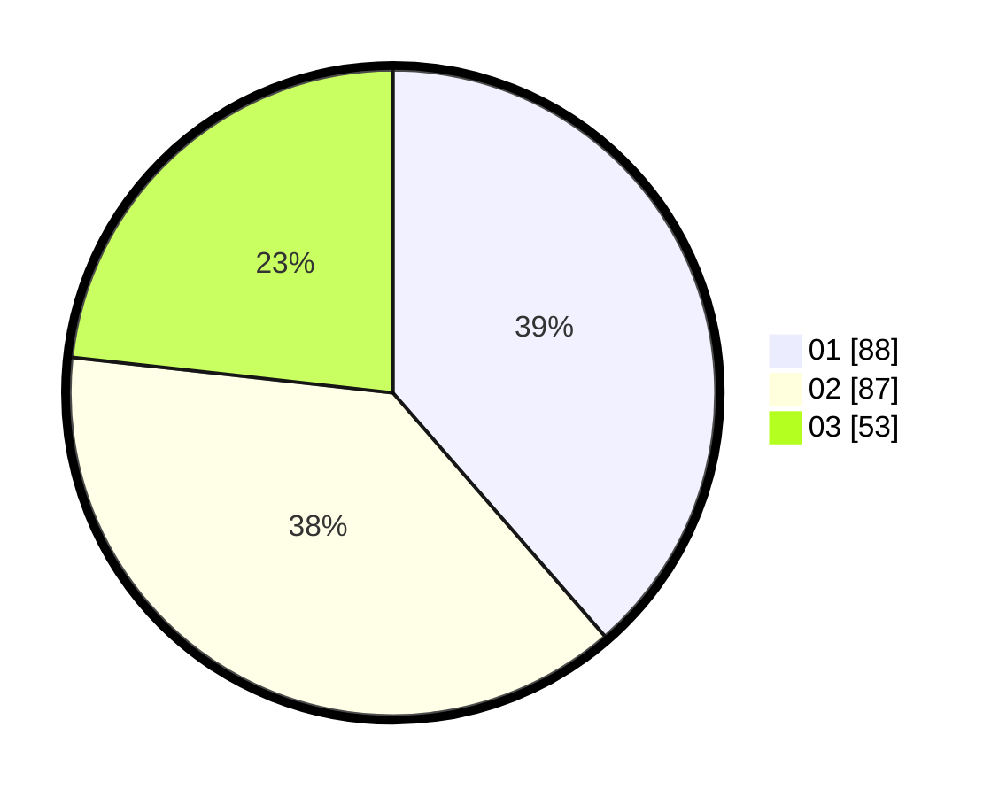

# Hasil

Hasil perolehan suara paslon dapat dilihat pada file paslon-01.txt, paslon-02.txt, dan paslon-03.txt.

Jika tidak ada, artinya data tersebut belum ada pada SIREKAP.

## Perolehan Suara

 * Paslon 01: **88**.
 * Paslon 02: **87**.
 * Paslon 03: **53**.

## Foto C Plano

https://sirekap-obj-formc.kpu.go.id/1f4d/pemilu/ppwp/31/75/03/10/05/3175031005009-20240216-025935--0ef4f998-deb1-448f-a82e-089d7a906cc3.jpg

https://sirekap-obj-formc.kpu.go.id/1f4d/pemilu/ppwp/31/75/03/10/05/3175031005009-20240216-135206--86284b81-1ad1-4d67-bc03-89a51c8fbdbe.jpg

https://sirekap-obj-formc.kpu.go.id/1f4d/pemilu/ppwp/31/75/03/10/05/3175031005009-20240216-025936--825e622c-b2a6-40e5-a37f-e1b9ead411de.jpg

## DATA PEMILIH TETAP

Jumlah pemilih dalam DPT: **278**.
 * L: **136**.
 * P: **142**.

## DATA PENGGUNA HAK PILIH

Jumlah pengguna hak pilih dalam DPT: **219**.
 * L: **98**.
 * P: **121**.

Jumlah pengguna hak pilih dalam DPTb: **11**.
 * L: **4**.
 * P: **7**.

Jumlah pengguna hak pilih dalam DPK: **1**.
 * L: **0**.
 * P: **1**.

Jumlah pengguna hak pilih: **231**.
 * L: **102**.
 * P: **129**.

## JUMLAH SUARA SAH DAN TIDAK SAH

JUMLAH SELURUH SUARA SAH: **228**.

JUMLAH SUARA TIDAK SAH: **3**.

JUMLAH SELURUH SUARA SAH DAN SUARA TIDAK SAH: **231**.
