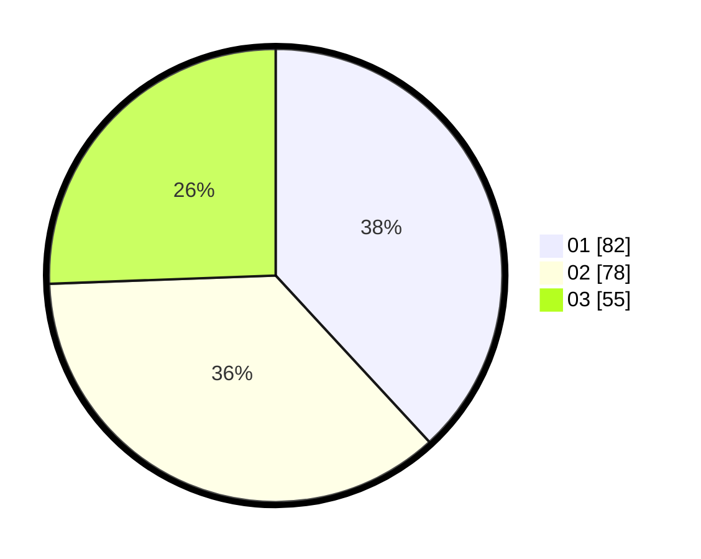

# Hasil

Hasil perolehan suara paslon dapat dilihat pada file paslon-01.txt, paslon-02.txt, dan paslon-03.txt.

Jika tidak ada, artinya data tersebut belum ada pada SIREKAP.

## Perolehan Suara

 * Paslon 01: **82**.
 * Paslon 02: **78**.
 * Paslon 03: **55**.

## Foto C Plano

https://sirekap-obj-formc.kpu.go.id/5f0f/pemilu/ppwp/31/75/03/10/05/3175031005010-20240215-011842--766ef06b-0d3a-4ee1-865a-8d54a348d766.jpg

https://sirekap-obj-formc.kpu.go.id/5f0f/pemilu/ppwp/31/75/03/10/05/3175031005010-20240214-194310--a0b60d55-c294-4978-82ab-1ad33ba84617.jpg

https://sirekap-obj-formc.kpu.go.id/5f0f/pemilu/ppwp/31/75/03/10/05/3175031005010-20240214-194340--b90f9b66-2700-45ad-85e6-de48dee1148b.jpg
