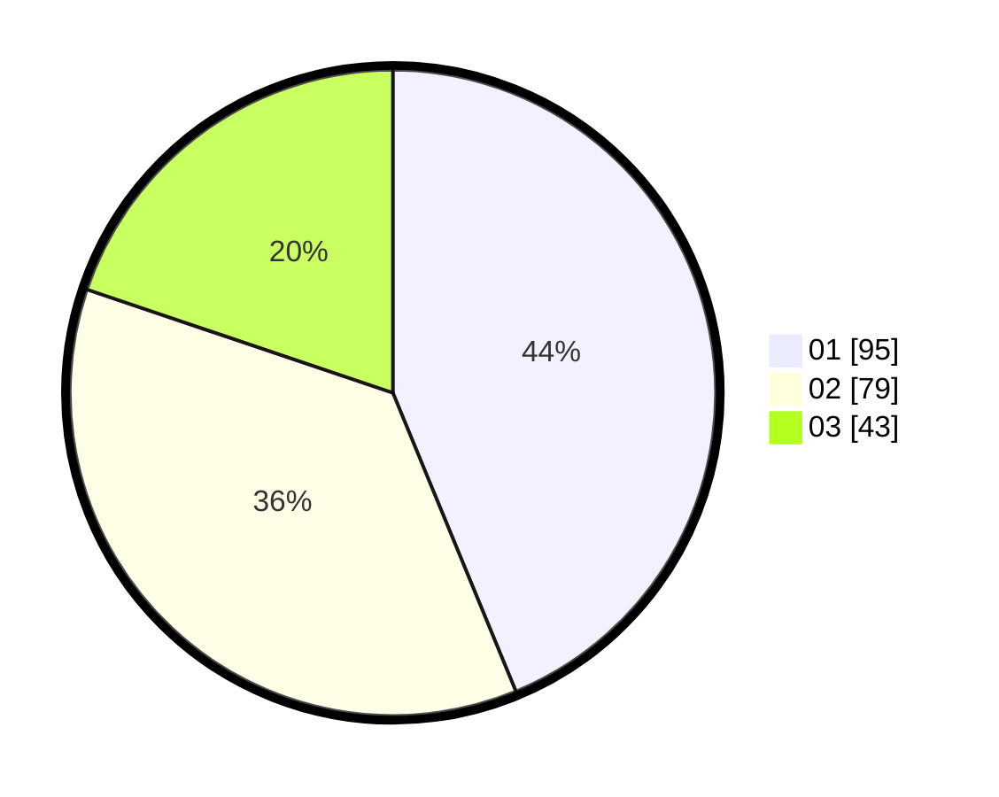

# Hasil

Hasil perolehan suara paslon dapat dilihat pada file paslon-01.txt, paslon-02.txt, dan paslon-03.txt.

Jika tidak ada, artinya data tersebut belum ada pada SIREKAP.

## Perolehan Suara

 * Paslon 01: **95**.
 * Paslon 02: **79**.
 * Paslon 03: **43**.

## Foto C Plano

https://sirekap-obj-formc.kpu.go.id/bb6c/pemilu/ppwp/31/75/03/10/05/3175031005012-20240215-205359--20ce1069-5809-471e-b3f6-0e6a4743e240.jpg

https://sirekap-obj-formc.kpu.go.id/bb6c/pemilu/ppwp/31/75/03/10/05/3175031005012-20240215-205402--69949aca-a642-49e3-8220-5dc061b0a998.jpg

https://sirekap-obj-formc.kpu.go.id/bb6c/pemilu/ppwp/31/75/03/10/05/3175031005012-20240215-205400--f343e0b9-0c0e-418e-84a1-f2b5fe597e96.jpg

## DATA PEMILIH TETAP

Jumlah pemilih dalam DPT: **276**.
 * L: **126**.
 * P: **150**.

## DATA PENGGUNA HAK PILIH

Jumlah pengguna hak pilih dalam DPT: **213**.
 * L: **93**.
 * P: **120**.

Jumlah pengguna hak pilih dalam DPTb: **6**.
 * L: **3**.
 * P: **3**.

Jumlah pengguna hak pilih dalam DPK: **2**.
 * L: **2**.
 * P: **0**.

Jumlah pengguna hak pilih: **221**.
 * L: **98**.
 * P: **123**.

## JUMLAH SUARA SAH DAN TIDAK SAH

JUMLAH SELURUH SUARA SAH: **217**.

JUMLAH SUARA TIDAK SAH: **4**.

JUMLAH SELURUH SUARA SAH DAN SUARA TIDAK SAH: **221**.
