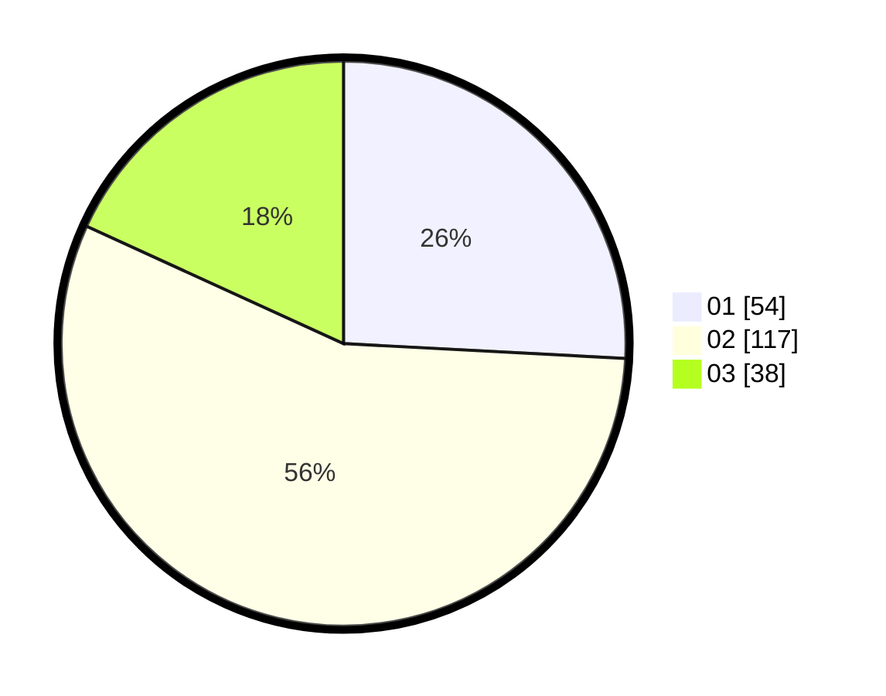

# Hasil

Hasil perolehan suara paslon dapat dilihat pada file paslon-01.txt, paslon-02.txt, dan paslon-03.txt.

Jika tidak ada, artinya data tersebut belum ada pada SIREKAP.

## Perolehan Suara

 * Paslon 01: **54**.
 * Paslon 02: **117**.
 * Paslon 03: **38**.

## Foto C Plano

https://sirekap-obj-formc.kpu.go.id/7f67/pemilu/ppwp/31/75/03/10/05/3175031005016-20240214-221056--8e39e7ec-ffed-40ab-962c-3680f8252641.jpg

https://sirekap-obj-formc.kpu.go.id/7f67/pemilu/ppwp/31/75/03/10/05/3175031005016-20240214-221117--fdb2c5bf-674e-490b-b755-1f76c083aecb.jpg

https://sirekap-obj-formc.kpu.go.id/7f67/pemilu/ppwp/31/75/03/10/05/3175031005016-20240214-221106--e85560d0-6c16-4656-90bb-610e6d4d4ec7.jpg

## DATA PEMILIH TETAP

Jumlah pemilih dalam DPT: **275**.
 * L: **134**.
 * P: **141**.

## DATA PENGGUNA HAK PILIH

Jumlah pengguna hak pilih dalam DPT: **205**.
 * L: **100**.
 * P: **105**.

Jumlah pengguna hak pilih dalam DPTb: **3**.
 * L: **2**.
 * P: **1**.

Jumlah pengguna hak pilih dalam DPK: **3**.
 * L: **2**.
 * P: **1**.

Jumlah pengguna hak pilih: **211**.
 * L: **104**.
 * P: **107**.

## JUMLAH SUARA SAH DAN TIDAK SAH

JUMLAH SELURUH SUARA SAH: **209**.

JUMLAH SUARA TIDAK SAH: **2**.

JUMLAH SELURUH SUARA SAH DAN SUARA TIDAK SAH: **211**.
