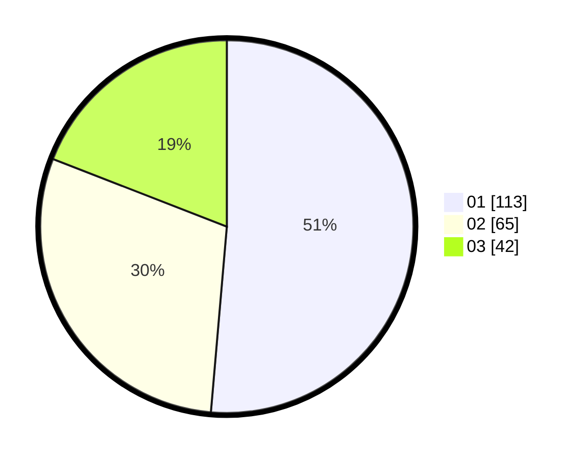

# Hasil

Hasil perolehan suara paslon dapat dilihat pada file paslon-01.txt, paslon-02.txt, dan paslon-03.txt.

Jika tidak ada, artinya data tersebut belum ada pada SIREKAP.

## Perolehan Suara

 * Paslon 01: **113**.
 * Paslon 02: **65**.
 * Paslon 03: **42**.

## Foto C Plano

https://sirekap-obj-formc.kpu.go.id/2612/pemilu/ppwp/31/75/03/10/05/3175031005020-20240214-191433--c5e7d349-be7a-4ad8-a643-508bb3a933f0.jpg

https://sirekap-obj-formc.kpu.go.id/2612/pemilu/ppwp/31/75/03/10/05/3175031005020-20240214-200130--25fec914-42fe-486a-a963-1abf1b42fdb5.jpg

https://sirekap-obj-formc.kpu.go.id/2612/pemilu/ppwp/31/75/03/10/05/3175031005020-20240214-194609--fd82f624-1620-4189-9469-baae7cb6dca8.jpg

## DATA PEMILIH TETAP

Jumlah pemilih dalam DPT: **283**.
 * L: **127**.
 * P: **156**.

## DATA PENGGUNA HAK PILIH

Jumlah pengguna hak pilih dalam DPT: **221**.
 * L: **94**.
 * P: **127**.

Jumlah pengguna hak pilih dalam DPTb: **0**.
 * L: **0**.
 * P: **0**.

Jumlah pengguna hak pilih dalam DPK: **5**.
 * L: **0**.
 * P: **5**.

Jumlah pengguna hak pilih: **226**.
 * L: **94**.
 * P: **132**.

## JUMLAH SUARA SAH DAN TIDAK SAH

JUMLAH SELURUH SUARA SAH: **220**.

JUMLAH SUARA TIDAK SAH: **6**.

JUMLAH SELURUH SUARA SAH DAN SUARA TIDAK SAH: **226**.
