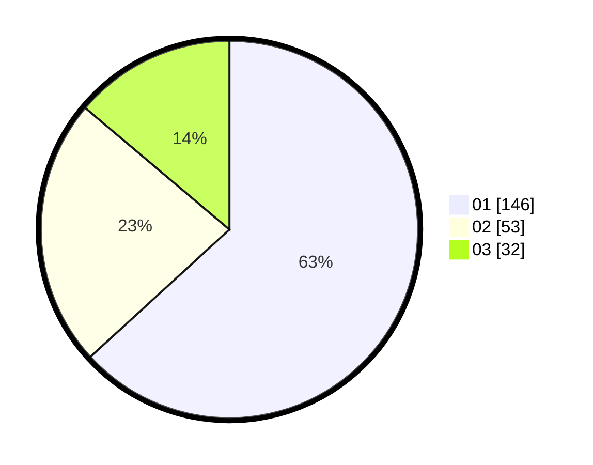

# Hasil

Hasil perolehan suara paslon dapat dilihat pada file paslon-01.txt, paslon-02.txt, dan paslon-03.txt.

Jika tidak ada, artinya data tersebut belum ada pada SIREKAP.

## Perolehan Suara

 * Paslon 01: **146**.
 * Paslon 02: **53**.
 * Paslon 03: **32**.

## Foto C Plano

https://sirekap-obj-formc.kpu.go.id/4897/pemilu/ppwp/31/75/03/10/05/3175031005024-20240215-054421--c9282b2c-649a-4571-97c0-ca20f28d262c.jpg

https://sirekap-obj-formc.kpu.go.id/4897/pemilu/ppwp/31/75/03/10/05/3175031005024-20240215-054449--b8603f5f-85af-44ae-aa0e-33268f727e5c.jpg

https://sirekap-obj-formc.kpu.go.id/4897/pemilu/ppwp/31/75/03/10/05/3175031005024-20240215-054439--4854ceb7-634c-4502-9987-bffd3883cd20.jpg

## DATA PEMILIH TETAP

Jumlah pemilih dalam DPT: **286**.
 * L: **142**.
 * P: **144**.

## DATA PENGGUNA HAK PILIH

Jumlah pengguna hak pilih dalam DPT: **221**.
 * L: **107**.
 * P: **114**.

Jumlah pengguna hak pilih dalam DPTb: **13**.
 * L: **3**.
 * P: **10**.

Jumlah pengguna hak pilih dalam DPK: **0**.
 * L: **0**.
 * P: **0**.

Jumlah pengguna hak pilih: **234**.
 * L: **110**.
 * P: **124**.

## JUMLAH SUARA SAH DAN TIDAK SAH

JUMLAH SELURUH SUARA SAH: **231**.

JUMLAH SUARA TIDAK SAH: **3**.

JUMLAH SELURUH SUARA SAH DAN SUARA TIDAK SAH: **234**.
