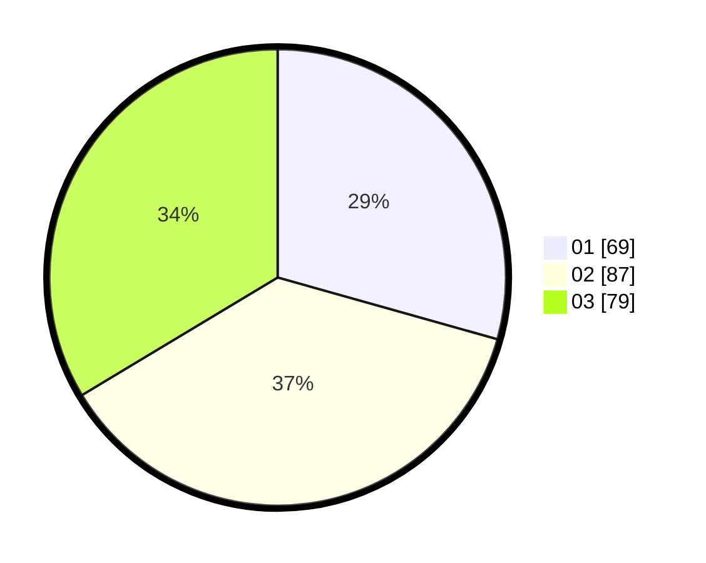

# Hasil

Hasil perolehan suara paslon dapat dilihat pada file paslon-01.txt, paslon-02.txt, dan paslon-03.txt.

Jika tidak ada, artinya data tersebut belum ada pada SIREKAP.

## Perolehan Suara

 * Paslon 01: **69**.
 * Paslon 02: **87**.
 * Paslon 03: **79**.

## Foto C Plano

https://sirekap-obj-formc.kpu.go.id/a25c/pemilu/ppwp/31/75/03/10/05/3175031005026-20240214-233522--d2296286-3b61-4a63-b9ea-fb447dbaf86f.jpg

https://sirekap-obj-formc.kpu.go.id/a25c/pemilu/ppwp/31/75/03/10/05/3175031005026-20240214-233754--5d7a0290-b0aa-4e94-8fef-fa73f7cfaf61.jpg

https://sirekap-obj-formc.kpu.go.id/a25c/pemilu/ppwp/31/75/03/10/05/3175031005026-20240214-234007--dcfac18b-7dea-4de3-9e30-423775eb4bb0.jpg
