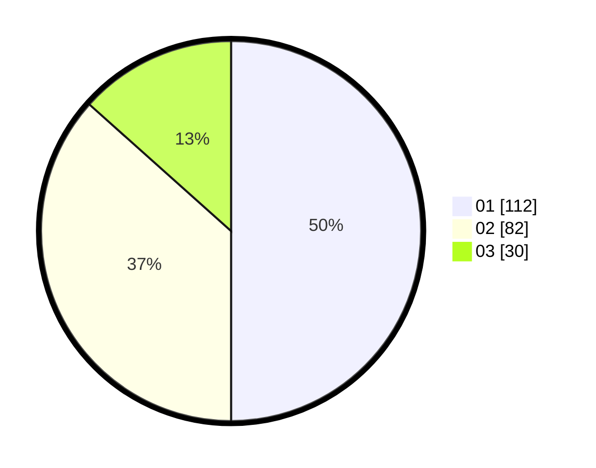

# Hasil

Hasil perolehan suara paslon dapat dilihat pada file paslon-01.txt, paslon-02.txt, dan paslon-03.txt.

Jika tidak ada, artinya data tersebut belum ada pada SIREKAP.

## Perolehan Suara

 * Paslon 01: **112**.
 * Paslon 02: **82**.
 * Paslon 03: **30**.

## Foto C Plano

https://sirekap-obj-formc.kpu.go.id/13bc/pemilu/ppwp/31/75/03/10/05/3175031005029-20240216-002817--dfac7bb1-3fc2-4c07-bf6d-d580af161796.jpg

https://sirekap-obj-formc.kpu.go.id/13bc/pemilu/ppwp/31/75/03/10/05/3175031005029-20240216-002820--c44c332e-cfb7-4ef5-a024-dc5e5f4f6c6d.jpg

https://sirekap-obj-formc.kpu.go.id/13bc/pemilu/ppwp/31/75/03/10/05/3175031005029-20240216-002818--c407ead4-93b9-4ebd-857e-1651feba1f5b.jpg

## DATA PEMILIH TETAP

Jumlah pemilih dalam DPT: **280**.
 * L: **133**.
 * P: **147**.

## DATA PENGGUNA HAK PILIH

Jumlah pengguna hak pilih dalam DPT: **209**.
 * L: **97**.
 * P: **112**.

Jumlah pengguna hak pilih dalam DPTb: **16**.
 * L: **9**.
 * P: **7**.

Jumlah pengguna hak pilih dalam DPK: **3**.
 * L: **3**.
 * P: **0**.

Jumlah pengguna hak pilih: **228**.
 * L: **109**.
 * P: **119**.

## JUMLAH SUARA SAH DAN TIDAK SAH

JUMLAH SELURUH SUARA SAH: **224**.

JUMLAH SUARA TIDAK SAH: **4**.

JUMLAH SELURUH SUARA SAH DAN SUARA TIDAK SAH: **228**.
