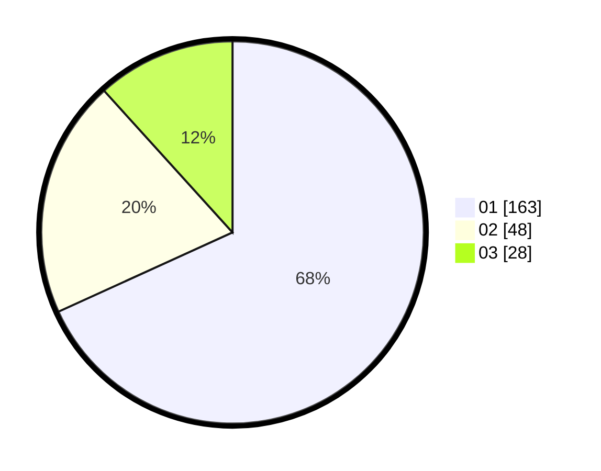

# Hasil

Hasil perolehan suara paslon dapat dilihat pada file paslon-01.txt, paslon-02.txt, dan paslon-03.txt.

Jika tidak ada, artinya data tersebut belum ada pada SIREKAP.

## Perolehan Suara

 * Paslon 01: **163**.
 * Paslon 02: **48**.
 * Paslon 03: **28**.

## Foto C Plano

https://sirekap-obj-formc.kpu.go.id/1761/pemilu/ppwp/31/75/03/10/05/3175031005031-20240216-003410--1cbd7e86-934e-4b95-b92b-166a9a056f1e.jpg

https://sirekap-obj-formc.kpu.go.id/1761/pemilu/ppwp/31/75/03/10/05/3175031005031-20240214-201750--7bffe1ab-2c5e-45e2-a617-8ad6ed492300.jpg

https://sirekap-obj-formc.kpu.go.id/1761/pemilu/ppwp/31/75/03/10/05/3175031005031-20240216-003414--2567c3f6-b1ef-4d3a-b0c4-a91853d89557.jpg

## DATA PEMILIH TETAP

Jumlah pemilih dalam DPT: **277**.
 * L: **135**.
 * P: **142**.

## DATA PENGGUNA HAK PILIH

Jumlah pengguna hak pilih dalam DPT: **228**.
 * L: **100**.
 * P: **128**.

Jumlah pengguna hak pilih dalam DPTb: **13**.
 * L: **4**.
 * P: **9**.

Jumlah pengguna hak pilih dalam DPK: **1**.
 * L: **0**.
 * P: **1**.

Jumlah pengguna hak pilih: **242**.
 * L: **104**.
 * P: **138**.

## JUMLAH SUARA SAH DAN TIDAK SAH

JUMLAH SELURUH SUARA SAH: **239**.

JUMLAH SUARA TIDAK SAH: **3**.

JUMLAH SELURUH SUARA SAH DAN SUARA TIDAK SAH: **242**.
