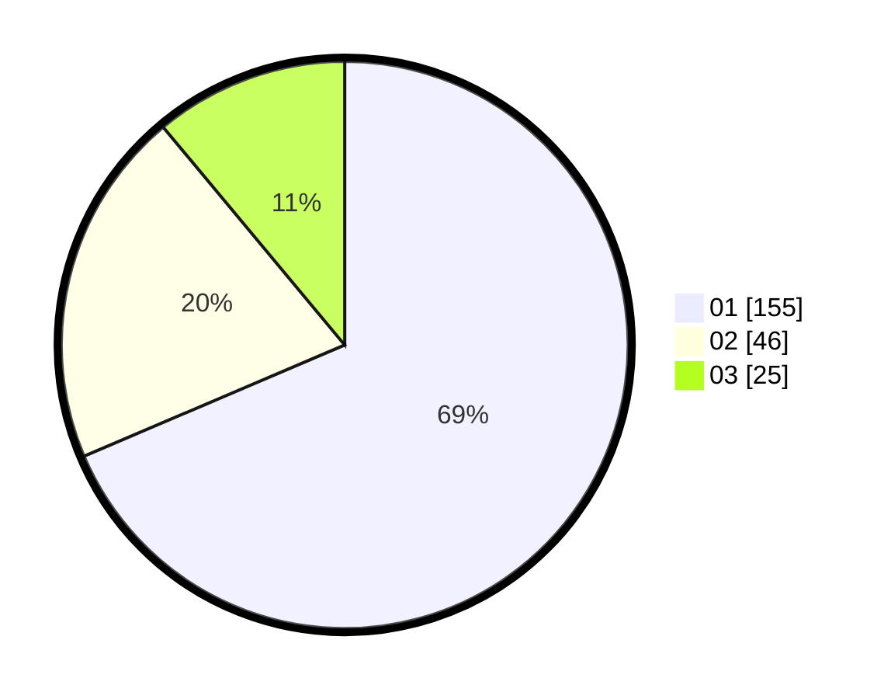

# Hasil

Hasil perolehan suara paslon dapat dilihat pada file paslon-01.txt, paslon-02.txt, dan paslon-03.txt.

Jika tidak ada, artinya data tersebut belum ada pada SIREKAP.

## Perolehan Suara

 * Paslon 01: **155**.
 * Paslon 02: **46**.
 * Paslon 03: **25**.

## Foto C Plano

https://sirekap-obj-formc.kpu.go.id/07ca/pemilu/ppwp/31/75/03/10/05/3175031005033-20240215-000942--fb5f5cf2-bd72-467d-81df-29384fff09be.jpg

https://sirekap-obj-formc.kpu.go.id/07ca/pemilu/ppwp/31/75/03/10/05/3175031005033-20240215-001456--d2b3b7bd-1719-4e15-b4fa-de952aa85243.jpg
